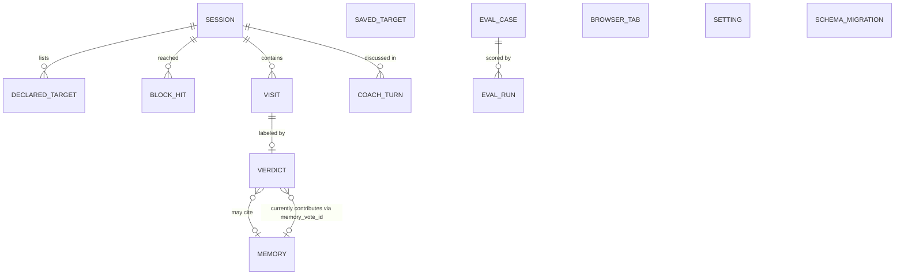

# Data Model / Schema — Ledger

> **Purpose:** the local file. Classification policy is not defined here. No `security.md` is in this set. The Class column uses two provisional tags, `internal` and `on-device private`, and does not pretend those tags are a retention policy.

**Engine.** `node:sqlite` (Electron 44 / Node 24). The store is one local file (`ledger.db`).

## 1. Entity Relationships

A session may have zero declared targets, zero visits, and zero coach turns. A visit has zero verdicts until Harness writes one, then exactly one. A verdict may cite memory as its classification source (`memory_id`) and separately may contribute one current learning vote (`memory_vote_id`). These are independent optional links, not a tap history. An eval case may have zero runs. Eval cases are not visits.

## 2. Entities & Fields

Class `on-device private` means the field can name a person's document or account. It stays in the local file (BR-005). There is no retention period in this doc.

### Session

**Stored in:** SQLite table `session` · **Written by:** SessionUI, via Store

| Field | Type | Null? | Default | Class | Description |
|-------|------|-------|---------|-------|-------------|
| `id` | text | no | generated | internal | Primary key. Not reused. |
| `intention` | text | no | `''` | on-device private | The sentence. Empty is a real state (US-001). |
| `analyzed_intent` | text | yes | null | on-device private | The one on-device reading Decider judges. Null if unread, empty intention, or the reading failed. The typed sentence stays in `intention`. |
| `started_at` | text | no | — | internal | ISO-8601 start. |
| `ended_at` | text | yes | null | internal | Null while the session runs. |
| `outcome` | text | yes | null | internal | `yes`, `not_yet`, or `unanswered`. Null until the review closes. |
| `work_min` | integer | yes | null | internal | Work minutes in one cycle. Null when the session has no cycle. |
| `break_min` | integer | yes | null | internal | Break minutes between work periods. |
| `cycle_count` | integer | yes | null | internal | Number of work periods in the planned cycle. |
| `phase` | text | yes | null | internal | `work` or `break` while a cycle runs. Null when no phase is active. |
| `phase_ends_at` | text | yes | null | internal | ISO-8601 when the current phase ends. Null when `phase` is null. |

### Declared target

**Stored in:** SQLite table `declared_target` · **Written by:** SessionUI, via Store

| Field | Type | Null? | Default | Class | Description |
|-------|------|-------|---------|-------|-------------|
| `id` | text | no | generated | internal | Primary key. |
| `session_id` | text | no | — | internal | The session this list belongs to. |
| `target` | text | no | — | on-device private | App name or site, as the person typed it. |
| `role` | text | no | — | internal | `work` or `distraction`. |

### Saved target

**Stored in:** SQLite table `saved_target` · **Written by:** Sites, via Store

| Field | Type | Null? | Default | Class | Description |
|-------|------|-------|---------|-------|-------------|
| `target` | text pk | no | — | on-device private | App name or site. Primary key. |
| `role` | text | no | — | internal | `work` or `block`. |

The popup copies these into `declared_target` for one session. Editing the popup does not write this table. The Sites screen does. See [ADR-012](adr/ADR-012-meant-loop-on-device.md).

### Block hit

**Stored in:** SQLite table `block_hit` · **Written by:** Blocker, via Store

| Field | Type | Null? | Default | Class | Description |
|-------|------|-------|---------|-------|-------------|
| `id` | text | no | generated | internal | Primary key. |
| `session_id` | text | no | — | internal | The session where the reach happened. |
| `target` | text | no | — | on-device private | The blocked app or site that was reached. |
| `kind` | text | no | — | internal | `site` or `app`. |
| `reached_at` | text | no | — | internal | ISO-8601. There is no duration column. At most one row per target per session. |

### Visit

**Stored in:** SQLite table `visit` · **Written by:** Capture, via Store

| Field | Type | Null? | Default | Class | Description |
|-------|------|-------|---------|-------|-------------|
| `id` | text | no | generated | internal | Primary key. |
| `session_id` | text | no | — | internal | Parent session. |
| `app_name` | text | no | — | on-device private | Frontmost app (x-win `info.name`, e.g. "Microsoft Word"); `Away` on an away visit. |
| `exec_name` | text | yes | null | on-device private | Process name (x-win `info.execName`, e.g. `WINWORD`). Rules and memory match on it. Null on away visits and on rows from before migration `002`. |
| `window_title` | text | yes | null | on-device private | Null when the OS did not provide one. Kept so a past review can render (open question in [`prd.md` §7](prd.md)). |
| `url` | text | yes | null | on-device private | Null when the browser did not provide one. |
| `last_seen_at` | text | no | — | internal | ISO-8601 timestamp of latest tick seen frontmost. |
| `started_at` | text | no | — | internal | ISO-8601. |
| `ended_at` | text | yes | null | internal | Null on the open visit. |
| `kind` | text | no | — | internal | `attention` or `away`. |

### Verdict

**Stored in:** SQLite table `verdict` · **Written by:** Harness, via Store

| Field | Type | Null? | Default | Class | Description |
|-------|------|-------|---------|-------|-------------|
| `id` | text | no | generated | internal | Primary key. |
| `visit_id` | text | no | — | internal | One current verdict per visit. |
| `memory_id` | text | yes | null | internal | Set when source is `memory`. |
| `memory_vote_id` | text | yes | null | internal | Current distinct-visit learning contribution to a memory row. Internal only; not exposed as public `Verdict.memoryId`. |
| `source` | text | no | — | internal | `rule`, `memory`, `model`, or `user`. |
| `label` | text | no | — | internal | `serves`, `drifts`, or `unclear`. |
| `reason` | text | yes | null | internal | Short text from the model, or null for a rule. |
| `model_id` | text | yes | null | internal | Set when source is `model`. |
| `model_stage` | text | yes | null | internal | `decide` or `reason` (check `model_stage IN ('decide', 'reason')`). Set when source is `model`. |
| `latency_ms` | integer | yes | null | internal | Set when a model call returned. Not a budget. |
| `confidence` | real | yes | null | internal | S1 confidence when model; null for rule and user. The review does not treat this as a score (BR-006). |

`reason` is easy to fill with a title by accident. Harness must not copy `window_title` or `url` into it. The review already shows those from the visit.

### Memory

**Stored in:** SQLite table `memory` · **Written by:** Harness, via Store

| Field | Type | Null? | Default | Class | Description |
|-------|------|-------|---------|-------|-------------|
| `id` | text | no | generated | internal | Primary key. |
| `match_key` | text | no | — | on-device private | URL host, else the lowercased process name (`exec_name`, or `app_name` when that is null). Not a window title, so a document name does not become the key. |
| `label` | text | no | — | internal | `serves` or `drifts`. |
| `tap_count` | integer | no | `0` | internal | Distinct visits contributing to the current label since the last reset/forget. BR-004 uses it; a row at 1 is not applied. |

### Coach turn

**Stored in:** SQLite table `coach_turn` · **Written by:** Coach, via Store

| Field | Type | Null? | Default | Class | Description |
|-------|------|-------|---------|-------|-------------|
| `id` | text | no | generated | internal | Primary key. |
| `session_id` | text | no | — | internal | The ended session this turn is about. |
| `role` | text | no | — | internal | `user` or `assistant`. |
| `text` | text | no | — | on-device private | What was said. The user's turn can quote a window. It stays in the local file (BR-005). |
| `created_at` | text | no | — | internal | ISO-8601. |

A turn exists only for a session that has ended. Drop memory does not delete these rows. Deleting the file does.

### Browser tab

**Stored in:** SQLite table `browser_tab` · **Written by:** NativeHost

| Field | Type | Null? | Default | Class | Description |
|-------|------|-------|---------|-------|-------------|
| `id` | integer pk | no | — | internal | Check `id = 1`. Single-row state table. |
| `url` | text | yes | null | on-device private | Active tab URL. |
| `title` | text | yes | null | on-device private | Active tab title. |
| `browser` | text | no | — | internal | Browser name (`chrome`, `msedge`, `brave`, etc.). |
| `updated_at` | text | no | — | internal | ISO-8601 timestamp of last relay. |

### Setting

**Stored in:** SQLite table `setting` · **Written by:** Eval / Harness, via Store

| Field | Type | Null? | Default | Class | Description |
|-------|------|-------|---------|-------|-------------|
| `key` | text pk | no | — | internal | `tau`, or a feature switch: `judge`, `coach`, `companion`. |
| `value` | text | no | — | internal | For `tau`, the threshold string. For a switch, `on` or `off`. A missing switch row means on. |

### Schema migration

**Stored in:** SQLite table `schema_migration` · **Written by:** Store

| Field | Type | Null? | Default | Class | Description |
|-------|------|-------|---------|-------|-------------|
| `name` | text pk | no | — | internal | Migration SQL filename. |
| `applied_at` | text | no | — | internal | ISO-8601 timestamp applied. |

### Eval case

**Stored in:** SQLite table `eval_case` · **Written by:** the repo's fixture load, via Eval

| Field | Type | Null? | Default | Class | Description |
|-------|------|-------|---------|-------|-------------|
| `id` | text | no | generated | internal | Primary key. |
| `fixture` | text | no | — | internal | The window description the case is judged from. Authored fixtures, not captured user visits. |
| `expected_label` | text | no | — | internal | `serves`, `drifts`, or `unclear`. |

Fixture format (`eval/fixtures.json`): `[{id, intention, targets:[{target, role}], app, title, url | null, os:'win' | 'mac' | 'linux', expected}]`.
Mix: 60 cases total, 20 per OS. 15 resolvable by rules; 45 residual, split about evenly between serves and drifts, with ≥ 8 deliberately ambiguous cases expected `unclear`. Includes the four `idea.md` §3 probe windows. Titles are authored, never copied from real user history.
The authored set currently has 18 serves, 18 drifts, and 9 unclear residual cases. It was authored after prompt tuning; the four required probes overlap the tuning evidence. No user history was used. Frozen input SHA-256: `97c9e0acbfab3634336723e002d6e29b9b0378b710e649e6f37a3d1a8516b02e`. Evaluation provenance and measured results live in system-design §9 "τ (eval)".

### Eval run

**Stored in:** SQLite table `eval_run` · **Written by:** Eval, via Store

| Field | Type | Null? | Default | Class | Description |
|-------|------|-------|---------|-------|-------------|
| `id` | text | no | generated | internal | Primary key. |
| `run_id` | text | no | — | internal | Identifies the eval execution run batch. |
| `eval_case_id` | text | no | — | internal | The case this attempt scored. |
| `source` | text | no | — | internal | Which harness stage answered. |
| `got_label` | text | no | — | internal | The label that came back. |
| `confidence` | real | yes | null | internal | Confidence score if model evaluated. |
| `model_id` | text | yes | null | internal | Model identifier when model ran. |
| `model_stage` | text | yes | null | internal | `decide` or `reason` if model ran. |
| `ran_at` | text | no | — | internal | ISO-8601. A missing row means US-009 shows "not run". |

No field is stored for a future dashboard. Model-call count is a count of `verdict` where `source = 'model'`. Coach-turn count is a count of `coach_turn`.

## 3. Constraints & Indexes

| Entity | Constraint / Index | Type | Why it exists |
|--------|--------------------|------|---------------|
| Session | `pk_session` | primary key | Identity |
| Session | `ck_session_outcome` | check | Null, `yes`, `not_yet`, or `unanswered` |
| Session | `ck_session_phase` | check | Null, `work`, or `break` |
| Session | `ux_session_one_running` | unique (`(1)`) where `ended_at IS NULL` | Only one session can run at a time |
| Saved target | `pk_saved_target` | primary key (`target`) | Identity |
| Saved target | `ck_saved_role` | check | `role` is `work` or `block` |
| Block hit | `pk_block_hit` | primary key | Identity |
| Block hit | `fk_hit_session` | foreign key, on delete cascade | Hits die with the session |
| Block hit | `ck_hit_kind` | check | `kind` is `site` or `app` |
| Block hit | `uq_block_hit_once` | unique (`session_id`, `target`) | One reach record per blocked target in a session |
| Coach turn | `pk_coach_turn` | primary key | Identity |
| Coach turn | `fk_coach_session` | foreign key, on delete cascade | Turns die with the session |
| Coach turn | `ck_coach_role` | check | `role` is `user` or `assistant` |
| Verdict | `ck_verdict_model_stage` | check | `model_stage` is null or in (`decide`, `reason`) |
| Browser tab | `pk_browser_tab` | primary key (`id`) | Identity |
| Browser tab | `ck_browser_tab_id` | check | `id = 1` |
| Setting | `pk_setting` | primary key (`key`) | Identity |
| Schema migration | `pk_schema_migration` | primary key (`name`) | Identity |
| Declared target | `fk_declared_session` | foreign key, on delete cascade | The list dies with the session |
| Declared target | `uq_declared_target` | unique (`session_id`, `target`) | One role per app or site in a session |
| Visit | `fk_visit_session` | foreign key, on delete cascade | Visits die with the session |
| Visit | `ix_visit_session_started` | index (`session_id`, `started_at`) | The review lists a session's visits in order |
| Verdict | `fk_verdict_visit` | foreign key, on delete cascade | The label dies with the visit |
| Verdict | `uq_verdict_visit` | unique (`visit_id`) | One current label. A tap updates the row. It does not insert a second one. |
| Verdict | `fk_verdict_memory` | foreign key, on delete set null | Dropping memory keeps the old verdict and clears the link (US-008) |
| Verdict | `memory_vote_id REFERENCES memory(id)` | foreign key, on delete set null | Forgetting memory releases current contributions without deleting historical labels |
| Verdict | `ix_verdict_memory_vote` | index (`memory_vote_id`) | Clears all current contributions when a key's label changes |
| Verdict | `ck_verdict_label` | check | Label is serves, drifts, or unclear (BR-003) |
| Memory | `uq_memory_key` | unique (`match_key`) | One remembered label per app or site |
| Eval run | `fk_run_case` | foreign key, on delete cascade | Runs die with the fixture |

`tap_count` is not the enforcement of BR-004. Harness enforces "do not apply at 1". The column is what a test reads. A unique key stops two memory rows for one site. US-009 reads the latest eval run by scanning that case's rows. The fixture set is small, so it has no index of its own.

## 4. Lifecycle & Migration

`outlives_demo` is true. Engine is `node:sqlite`.

- **Migration mechanism:** ordered SQL files (`electron/store/migrations/*.sql`) applied by Store at launch in filename order, recorded in `schema_migration(name, applied_at)`.
- **Migration `003_memory_votes.sql`:** adds the nullable contribution FK and its index, then sets existing `memory.tap_count` to 0. Old aggregates cannot recover distinct supporting visits. Sessions, visits, memory labels, and historical verdict labels are retained; old memory needs fresh support before eligibility returns.
- **Migration `006_analyzed_intent.sql`:** adds nullable `analyzed_intent` on `session`.
- **Migration `007_meant_loop.sql`:** adds cycle columns on `session`, and tables `saved_target`, `block_hit`, and `coach_turn`. Preset keywords are a file beside the app, not a table. The switches are rows in `setting` (`judge`, `coach`, `companion`; value `on` or `off`; a missing row means on).
- **Learning lifecycle:** a transaction writes the user's verdict and assigns its current contribution. Repeating the same label on the same visit does not increment support. A conflicting label clears that key's contribution links and resets its count before counting the current visit as 1. Other visits' historical labels remain unchanged; they can be tapped again to support the new label. Dropping memory clears both optional FKs through `ON DELETE SET NULL`, so the same visits can reteach after forgetting. This is current support, not lifetime deduplication ([ADR-010](adr/ADR-010-backend-work-ownership.md)).
- **How a change rolls out:** add a column or table, use it, then remove the old shape in a later build. Do not rename a column in one step.
- **Backfill strategy:** one local file, so a backfill is a single pass at launch. There is no fleet to watch.
- **Rollback:** keep a copy of the file next to the new build until the migration has been opened successfully. After a destructive step, rollback is the copy, not the new file.
- **Data deletion path:** US-008 deletes the file (`ledger.db`, `-wal`, `-shm`, and `widget.txt`), or deletes memory rows. Exclusive deletion/retry and pending-work ownership are defined in [system-design §9](system-design.md#9-build-spec). The policy for how long titles live is the open question in [`prd.md` §7](prd.md), not a period invented here.

## 5. Doc Integrity Check

- [x] Every entity in §1 has a field table, and every field table is in the diagram. `browser_tab`, `setting`, `schema_migration`, and `saved_target` have no relationships. `coach_turn` belongs to a session.
- [x] Every field has a SQLite type and an explicit nullability.
- [x] `on-device private` is a provisional tag. It does not define a retention rule. `security.md` is absent.
- [x] Every relationship has a foreign key and an on-delete behavior. Both nullable memory links use set null, matching their optional edges in §1; source attribution and current contribution are distinct.
- [x] Each index names its query. BR-004 is application-enforced and the column a test would read is named.
- [x] No validation copy from the stories is repeated as a second rule set, and no capacity number is stated.
- [x] Titles are stored because US-004 renders them later, not because they might be useful. `reason` is called out so it does not become a second copy of the title.

## References

- [`system-design.md`](system-design.md)
- [`prd.md`](prd.md)
- [`idea.md`](../idea.md)
