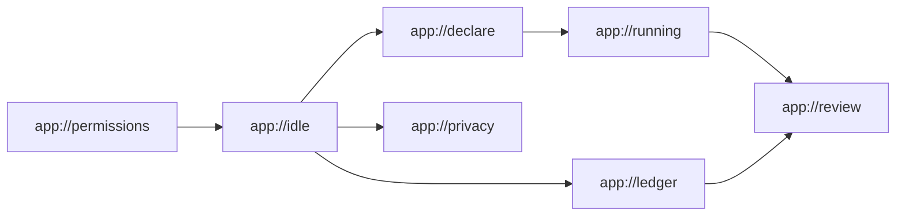

# Design — Ledger

> **Purpose:** what each screen is built from, and which in-app route it lives at.
> The screen list and the flow are owned by [`prd.md` §5](prd.md). This file does not restate them.

There is no HTTP server. A route here is an in-app address, not a URL on the network.

## 1. Design Principles

- Silence over a live badge on the running screen, because a verdict during the block is the interruption [ADR-001](adr/ADR-001-silent-review.md) rejected.
- System colors over a custom palette, because no visual source file exists and a invented brand color would be a decision nobody made.
- Words for counts over a percentage, because [`prd.md` BR-006](prd.md) forbids a rate.
- An unclear row over a guessed label, because the review is where the person settles a window the harness would not assert.

## 2. Routes & Actions

| Route | Screen ([`prd.md` §5.1](prd.md)) | Serves | Primary actions | Auth expectation |
|-------|----------------------------------|--------|-----------------|------------------|
| `app://permissions` | Permissions | US-002 | Open the OS prompt, return | local, no account |
| `app://idle` | Idle popover | US-001 | Start, open ledger, open privacy | local, no account |
| `app://declare` | Declare | US-001 | Edit intention, edit the two lists, start | local, no account |
| `app://running` | Running | US-001 | End the session | local, no account |
| `app://review` | Review | US-004, US-005, US-010 | Tap an unclear row, answer, dismiss | local, no account |
| `app://ledger` | Ledger | US-007 | Open a past review | local, no account |
| `app://privacy` | Privacy | US-008, US-009 | Drop memory, delete the file, run the eval | local, no account |

`local, no account` is the expectation on every route. There is no signed-in state to reach by mistake. No security doc is in this set. `context.md` sets `exposed_surface` to false.

## 3. Component Inventory

| Component | Purpose | Used on | Variants |
|-----------|---------|---------|----------|
| IntentionField | One text field for the sentence | Declare, Running, Review | editable, read-only |
| ListEditor | Add or remove an app or site | Declare | work, distraction |
| Clock | Elapsed time of the open session | Running | running |
| VisitRow | One visit, its source, and its label | Review | asserted, unclear, user, gap |
| OutcomePair | Yes and not yet, same visual weight | Review | unanswered, answered |
| SessionRow | Intention plus outcome in words | Ledger | empty, filled |
| PrivacyFacts | Model-call count, model id, no-network line | Privacy | no model, model named |
| ConfirmStep | Second step before a delete | Privacy | drop memory, delete file |

## 4. Tokens

No hex values. The shell uses the operating system's text and window colors until a visual source exists.

| Token | Value | Used for |
|-------|-------|----------|
| `color.ink` | system label color | text on every screen |
| `color.paper` | system window background | popover and review window |
| `type.ui` | system font | every component in §3 |
| `motion.running` | none | the running screen does not animate a verdict it is not allowed to show |

## 5. Visual States

| Pattern | Empty | Loading | Error | Success |
|---------|-------|---------|-------|---------|
| Declare | Intention blank, lists empty, Start still works | Not used. Start does not wait on a model. | Permission missing, with a link to `app://permissions` | Session started, route becomes `app://running` |
| Review list | No visits, plus the unrecorded gap if the clock moved | "Reading the local file" | File unreadable, sessions not invented | Rows with source on each label |
| Privacy confirm | Not used. The facts are always rendered. | Not used. Counts come from local rows. | Delete failed, file still present, say so | Drop or delete finished, and the next screen matches that |

## 6. UI Voice & Banned Copy

- Never use "unproductive", "distracted again", or "you failed the block". The outcome answer has to stay safe to give (BR-002).
- Never use a percent, a streak, or "hours focused". BR-006.
- Prefer "Unclear. You decide." over a label the model produced when the bar in [`idea.md` §9](../idea.md) is not met.
- Prefer "This build has no network client" over "your data is private". The second sentence claims more than US-008 checks.

## 7. Accessibility

- **Target standard:** WCAG 2.2 AA. Not tested. No assistive-technology pass has been run, and an automated check would not be conformance.
- Every action in §2 is reachable from the keyboard. The menu-bar extra is the operating system's, and this doc does not claim a custom global hotkey.
- Text uses `color.ink` on `color.paper`, which are the system pair, so contrast follows the OS theme rather than a custom ratio we have not measured.
- The outcome pair does not encode yes and not yet by color alone. Both are text buttons of the same weight (BR-002).

## 8. Provenance & Overrides

**Provenance:** none. No stylesheet or UI source exists in this repository.
Last synced: 2026-10-09, against an empty tree.

**Tool/library defaults this project deliberately overrides:**

- No UI library is chosen, so there is no default to override yet. When Bennet picks a shell, this section records any default that the running screen would otherwise animate.

## 9. Key Screen Specs

### Declare

- **Route:** `app://declare` · **Serves:** US-001
- **Layout:** intention field on top, work list, distraction list, Start.
- **Behaviour notes:** Start is enabled when the permission is granted, including when the intention is empty. Empty is a stored state, not a validation error.

### Running

- **Route:** `app://running` · **Serves:** US-001
- **Layout:** the intention, read-only, and the clock. One End control.
- **Behaviour notes:** no visit list and no verdict. Capture failures replace the clock line with the gap copy from US-002, not with a judgment.

### Review

- **Route:** `app://review` · **Serves:** US-004, US-005, US-010
- **Layout:** intention, unrecorded gap, visit rows, then the outcome pair.
- **Behaviour notes:** a row with source `user` says the person marked it. A row the bar will not assert is the unclear variant, with one tap for serves and one for drifts. Dismiss stores unanswered.

### Privacy

- **Route:** `app://privacy` · **Serves:** US-008, US-009
- **Layout:** facts, then the eval run, then the two destructive actions behind ConfirmStep.
- **Behaviour notes:** the eval area shows "not run" until US-009 has output. Delete is the local file, and the copy says that.

## 10. Doc Integrity Check

- [x] Every screen in [`prd.md` §5.1](prd.md) has a route in §2.
- [x] Every Serves cell names a real `US-###` from [`prd.md` §4](prd.md).
- [x] Every route names a story, and every story is on a route. US-003 and US-006 have no screen of their own. Their results show up on the review row and the privacy count. US-010 is on the review.
- [x] Every route declares an auth expectation.
- [x] Every component is used on a listed screen, and every token is used.
- [x] No pattern in §5 has a blank Empty, Loading, or Error cell.
- [x] Banned-copy lines state a reason and do not restate a population exclusion from [`idea.md` §10](../idea.md).

## References

- [`prd.md`](prd.md)
- [`idea.md`](../idea.md)
- [ADR-001](adr/ADR-001-silent-review.md)
