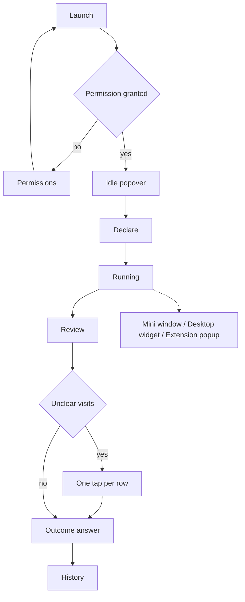

# Product — Ledger

> **Purpose:** the WHAT, for the team. Translates the brief into stories a build can be checked against.
> Traces back to: `idea.md` §6, §7, §8, §10. Traces forward to: design, system design, data model.

## 1. Product Purpose & Value Proposition

Ledger is for a self-employed person who works and gets distracted on the same computer. They say what they meant to finish. The app records the windows they actually used. The review puts those two side by side so the gap can be noticed. The question of whether they finished is asked and stored, and it is not the goal. Awareness is. Accountability loses where they conflict ([ADR-008](adr/ADR-008-awareness-over-accountability.md)). An on-device model judges only the windows they did not already classify. The title stays on the machine.

The one-sentence form is [`idea.md` §6](../idea.md). This paragraph is the only longer form.

**Success is measured by** the activation, retention, and value targets in [`idea.md` §8](../idea.md).

## 2. Personas

| Persona | Role & context | Problem frequency | Today's workaround | Stories |
|---------|----------------|-------------------|--------------------|---------|
| Worker | Self-employed, own laptop, own card. Work and distraction on that machine. The same stories cover people with the same behavior and no card. v1 does not paywall them. | End of a work block, on a typical workday | Memory, a timer, or a site blocker | US-001, US-002, US-003, US-004, US-005, US-006, US-007, US-008, US-010 |
| Builder | One of the three teammates, using Ledger on their own machine while building it | Daily during the hackathon, then whenever they dogfood | Reading logs | US-009 |

Employers and managers are not a persona. [`idea.md` §10](../idea.md) excludes them.

This cycle the team proves the loop on Windows first ([ADR-007](adr/ADR-007-windows-first.md)). The later buyer is a solo maker on an Apple Silicon Mac. That is not a second persona, and it has no story yet.

## 3. Feature Set & Priority

IDs and MoSCoW tiers match [`idea.md` §7](../idea.md). Nothing here adds an ID.

| `F-###` | Feature | Priority | Solves (problem) | Notes / why not |
|---------|---------|----------|------------------|-----------------|
| F-001 | Declare the intention and today's work and distraction list. Start immediately. | Must | The review needs the sentence. | |
| F-002 | Record the frontmost app, title, URL when available, and time away. | Must | Otherwise the answer comes from memory. | |
| F-003 | Judge in harness order. Rules, then memory, then the on-device model. Store source and label. | Must | The model alone mislabeled the probe. See [ADR-002](adr/ADR-002-harness-order.md). | |
| F-004 | Review the session so the gap can be noticed. The finish question is secondary. | Must | The training loop in [`idea.md` §1](../idea.md). | |
| F-005 | Memory from repeated taps. One tap does not become memory. | Must | The second session has to show a skipped model call. | |
| F-006 | History of past sessions. Repetition shows up as rows. | Should | Pattern lags behind a single review. | Core value survives a delay. |
| F-007 | Privacy panel, drop memory, delete the local file. | Must | The local claim has to be inspectable. | |
| F-008 | Eval set, precision only from a run. | Must | A claimed accuracy with no run fails the event. | |
| F-009 | Block sites or apps during the session. | Won't | Would hide the visits the review needs. | Reason and reconsider condition are in [`idea.md` §7](../idea.md). |
| F-010 | In-session drift signal. | Won't | A wrong flag would interrupt the block. | See [ADR-001](adr/ADR-001-silent-review.md). |
| F-011 | Review coach. | Won't | Advice pressures the outcome answer. | See [`idea.md` §7](../idea.md). |
| F-012 | Account and sync. | Won't | An account is a network surface. | See [`idea.md` §7](../idea.md). |
| F-013 | Score, rate, streak, or hours headline. | Won't | That number is what a manager would want. | See [`idea.md` §7](../idea.md). |

| Tier | Means | QA obligation |
|------|-------|----------------|
| **Must** | No point shipping without it | At least one test case, once `tests.md` exists |
| **Should** | The review still works without it for one release | At least one test case |
| **Could** | None in this set | — |
| **Won't** | Decided against for now | No story and no test |

## 4. User Stories & Acceptance Criteria

Story priority is Must or Should. A Won't feature has no story. No story is stricter than its feature.

**US-001 — Declare and start** *(F-001)* — Priority: Must
> As a **Worker**, I want to write what I intend to finish and start, so that the session is not waiting on a model.

- Given the popover is open and the capture permission is granted, when I enter an intention and press Start, then a session row exists with that text and a start time, and the running screen is up before any model call.
- Given the intention field is empty, when I press Start, then the session still starts, the intention is stored empty, and the review later shows that nothing could be judged against.

**US-002 — Record attention** *(F-002)* — Priority: Must
> As a **Worker**, I want the session to record where the machine was, so that the review is not my memory of the block.

- Given a session is running, when the frontmost app or window changes, then the previous visit is closed with its app name and the elapsed interval, and a new visit opens.
- Given the machine goes idle, when activity resumes, then the idle interval is stored as away rather than as attention on the last window.
- Given the capture permission is missing, when a session is running, then visits are not invented, and the review names the gap.
- Given a visit receives a verdict while the session is still running, when I look at the running screen, then the verdict is not on it.

**US-003 — Judge the residual** *(F-003)* — Priority: Must
> As a **Worker**, I want each visit labeled by the cheapest source that already knows it, so that the model is only asked about windows I did not classify.

- Given a visit's app or site is on this session's work or distraction list, when the visit closes, then the verdict source is rule, and no model call is recorded for it.
- Given the visit matches memory, when the visit closes, then the verdict source is memory, and no model call is recorded for it.
- Given the visit matches neither, when the model returns, then the verdict source is model and the label is serves, drifts, or unclear.
- Given the model returns anything else, times out, or is not loaded, when the visit is judged, then the label is unclear and the session keeps running.

**US-004 — Review the block** *(F-004)* — Priority: Must
> As a **Worker**, I want the intention beside the windows I used, so that I can notice what the block was.

- Given a session has ended, when the review opens, then the intention, each visit's app, the away total, and each verdict's label and source are the body of the screen. The finish question is on the screen and is not the headline.
- Given I answer yes or not yet, when the review closes, then the session stores that outcome, and nothing on the screen praises or scolds it.
- Given I close the review without answering, when I next open history, then the session's outcome is unanswered.
- Given the review renders a verdict, when the label is one the review is allowed to assert, then it is only asserted if it meets the bar in [`idea.md` §9](../idea.md). Otherwise the row is shown as unclear.

**US-005 — Resolve an unclear visit** *(F-004, F-005)* — Priority: Must
> As a **Worker**, I want one tap on a visit I recognize, so that the record uses my word for it.

- Given a visit is shown as unclear, when I mark it serves or drifts, then that visit's verdict source becomes user and the label matches the tap.
- Given I tap, when the review renders, then the row is marked as my label, not as a model verdict.
- Given this is the first tap for that app or site, when the next session visits it, then memory does not supply the label.

**US-006 — Skip a remembered window** *(F-005)* — Priority: Must
> As a **Worker**, I want a repeated label to stick, so that the model is not asked again about a window I have already settled.

- Given I have tapped the same app or site on more than one visit, when a later visit matches it, then the verdict source is memory and the model call count does not increase.

**US-007 — See the pattern as rows** *(F-006)* — Priority: Should
> As a **Worker**, I want past sessions listed, so that a repetition can be noticed after it has happened more than once.

- Given one ended session, when I open history, then that session is listed and the screen states no pattern.
- Given the same app appears in two or more sessions, when I open history, then I can see that repetition in the rows. The screen does not add a sentence that interprets it.
- Given any data, when history renders, then counts are words, and it shows no score, no rate, no streak, and no hours headline.

**US-008 — See what stayed on the machine** *(F-007)* — Priority: Must
> As a **Worker**, I want to see what the app ran and where the file is, so that I can check the privacy claim.

- Given any session history, when I open the privacy panel, then it shows the count of verdicts whose source is model, the model id or the fact that none is configured, and a statement that this build has no network client.
- Given I drop memory, when the panel confirms, then memory rows are gone and past visits keep the verdicts they already have.
- Given I delete the local file, when the panel confirms, then the next launch has no sessions.

The panel does not measure packets. A judge who wants byte counts uses a monitor outside the app. The panel will not notice a dependency that phones home.

**US-009 — Report precision from a run** *(F-008)* — Priority: Must
> As a **Builder**, I want the eval printed from a run against labeled windows, so that a demo cannot quote a number the set did not produce.

- Given the eval set has at least one case, when I run it, then the output counts how many asserted labels matched the expected label, split by verdict source.
- Given a case has not been run, when a screen shows precision, then it shows that the set has not been run, rather than a number.

**US-010 — Say what was not seen** *(F-002, F-004)* — Priority: Must
> As a **Worker**, I want the review to name time it did not capture, so that a short trace is not described as the whole block.

- Given the session's wall clock is longer than the sum of visit intervals, when the review opens, then it states the unrecorded duration and does not assign that duration to a window.

### 4.1 Cross-cutting rules (`BR-###`)

| `BR-###` | Rule | Invoked by |
|----------|------|------------|
| BR-001 | While a session is running, the UI shows the intention and the clock. It does not show a verdict, a warning, or praise. | US-001, US-002, US-004 |
| BR-002 | The outcome answer does not change the running UI. The review and the history do not praise yes or scold not yet. | US-004, US-007 |
| BR-007 | Where accountability would change what the person sees, the screen shows the record instead. The finish answer is stored and is not the headline. | US-004, US-007 |
| BR-003 | A model result that is not serves, drifts, or unclear is stored as unclear. A missing model is the same result. | US-003, US-004 |
| BR-004 | Memory supplies a label only after the same app or site was tapped on more than one visit. | US-005, US-006 |
| BR-005 | Window titles and URLs are written only to the local store. No story sends them to a network client, because this build does not have one. | US-002, US-003, US-008 |
| BR-006 | No screen shows a productivity score, a rate, a streak, or an hours headline. | US-004, US-007 |

## 5. App Flow & UX Intent

**Design reference:** [`design.md`](design.md). Visual stack: Electron with React through electron-vite ([ADR-003](adr/ADR-003-electron-and-node-llama-cpp.md)).

### 5.1 Screen Inventory

| Screen | Purpose | Entry points | States to design |
|--------|---------|--------------|------------------|
| Permissions | Explain the capture prompt and what fails without it (US-002) | First launch, or a session start while permission is denied | granted / denied / not-yet-asked |
| Idle popover | Start a session or open history and the privacy panel (US-001) | Menu-bar click while no session runs | empty history / has history |
| Declare | Write the intention and today's lists (US-001) | Start from the idle popover | empty intention / filled / permission missing |
| Running | Show the intention and the clock until the session ends (US-001, BR-001) | After Start | running / capture failing |
| Review | Read the record, resolve unclear rows, answer the question (US-004, US-005, US-010) | Session end | loading the record / ready / unanswered on dismiss |
| History | Past sessions as rows, so a repetition can be noticed (US-007) | Idle popover | empty / one session / repeated app |
| Privacy | Calls, model id, drop memory, delete file (US-008) | Idle popover, and the review | ready / confirm drop / confirm delete |
| Mini window | Always-on-top clock and intention display (US-001, BR-001) | Toggle from tray or shortcut | running / no session |
| Desktop widget | Display-only desktop layer widget on macOS (US-001, BR-001) | Automatic while session runs | running / no session |
| Extension popup | Chromium extension popup showing status (US-001, BR-001) | Click extension icon in browser | running / no session |

### 5.2 App Flow

**Linear (primary path):**

Permissions, if needed, then Idle popover, then Declare, then Running, then Review, then History.

**Branching:**

**Flow annotations:**

| Flow concern | Detail |
|--------------|--------|
| Entry points | Menu-bar click. No account link, no deep link, no second device. |
| Decision branches | Permission gates capture. Unclear visits gate the taps. The outcome can be skipped, which stores unanswered. |
| Dead ends | None. Permissions returns to launch. Delete in the privacy panel returns to an empty idle popover. |
| Abandonment / resume | Visits already written stay in the local file if the app quits. Closing the review without an answer stores unanswered. An open visit is closed at the last timestamp the app managed to write. |
| Edge cases | Empty intention still starts (US-001). Permission denied records a gap (US-002). Model missing yields unclear (US-003). URL unavailable leaves the URL empty and still stores the app and title. |

### 5.3 Onboarding Flow

- **Aha / first-value moment:** the first review, with the intention beside windows the person recognizes.
- **Time-to-first-value target:** not numbered. No measured setup time exists. The path is one permission prompt, one sentence, one work block, then the review.
- **Skippable / resumable:** the permission step is not skippable if they want capture. The outcome answer is skippable and then counts as unanswered.
- **Friction budget:** the OS permission prompt and the intention field. No account. The 1.28 GB model file is fetched once at setup, not at first launch of a session ([ADR-003](adr/ADR-003-electron-and-node-llama-cpp.md)).

### 5.4 UX Constraints

- Start does not wait on the model. The session row is written before any model call (US-001).
- A shown verdict names its source. The review reads `source` off the verdict row (US-004).
- The running screen has no verdict on it (BR-001). The running view simply does not bind that column.
- Counts in history are words (US-007). The formatter has no percent and no hours headline (BR-006). The finish count is not the headline (BR-007).

### 5.5 Instrumentation & Event Taxonomy

These are the rows the product already stores. There is no third-party analytics tool. Properties are ids and enums. Titles and URLs stay on the visit row and are not copied into a second log.

| Event name | Fires when | Key properties | Feeds metric |
|------------|-----------|----------------|--------------|
| `session_started` | Start is pressed | session id, intention empty or not | [`idea.md` §8](../idea.md) activation and intention share |
| `session_ended` | The session closes | session id, outcome or unanswered | Stored. Not a target. [`idea.md` §8](../idea.md) says the finished share is not a goal |
| `verdict_recorded` | A visit receives a label | visit id, source, label | F-008 precision by source, and the privacy panel's model-call count |
| `memory_applied` | A visit is labeled from memory | visit id, memory id | The second-run check in US-006 |

## 6. Non-Goals

Scope exclusions for whole populations and products are in [`idea.md` §10](../idea.md).

- Do not add a cloud model as a fallback when the local one is slow. The review has to finish offline. Revisit only for a feature that is labeled online and is not on the path of F-004.
- Do not polish macOS or Linux capture in this cycle. The development target is Windows. Revisit only if that path is stable and time remains ([ADR-007](adr/ADR-007-windows-first.md), [`idea.md` §10](../idea.md)).
- Rejected features F-009 through F-013 stay in §3. They are not repeated here.

## 7. Dependencies & Open Questions

**Dependencies**

- An OS permission that yields the frontmost app and window title. Without it, US-002's gap state is the product.
- A local model runtime: node-llama-cpp with Qwen3.5-2B, resolved in [ADR-003](adr/ADR-003-electron-and-node-llama-cpp.md).
- No hosted database and no account service. F-012 is Won't.

**Open questions**

- Which app shell and which model runtime. Resolved: Electron 44 + TypeScript + React (Vite + `vite-plugin-electron`), with node-llama-cpp running Qwen3.5-2B locally. See [ADR-003](adr/ADR-003-electron-and-node-llama-cpp.md) and [ADR-006](adr/ADR-006-template-vite-build.md).
- How the active browser URL is read, and on which browsers. Resolved: Windows (x-win UIA), macOS (x-win AppleScript), Linux (Chromium MV3 native messaging extension relay). See [ADR-004](adr/ADR-004-three-os-and-three-frontends.md).
- The smallest tap count above one before memory applies. `[assumption]` more than one, as BR-004 states, with no higher floor. A higher floor waits on F-008, not on a guessed constant.
- Whether old window titles are kept until the user deletes the file. `[assumption]` kept, because US-004 on a past session needs them. Revisit if the file grows past what the demo machine tolerates. No size number exists yet.
- The 0.80 bar is carried from the prior project. Whether this model can meet it is what F-008 measures. Until a run exists, the review treats model labels as unclear when they would be asserted below that bar.

## 8. Doc Integrity Check

- [x] Every `F-###` here exists in [`idea.md` §7](../idea.md) with the same ID and the same MoSCoW tier.
- [x] Every `US-###` names at least one real `F-###`, and every Must or Should feature has a story.
- [x] Every story priority is Must or Should, and none is stricter than its feature.
- [x] Every story has at least one Given/When/Then, and each result is observable.
- [x] Each persona has a story, and each story names a persona from §2.
- [x] Each `BR-###` is invoked by at least two stories.
- [x] Every screen in §5.1 appears in the §5.2 flow, and names its states.
- [x] Metrics, routes, and the 0.80 bar are links to their owners, not a second copy of the target.
- [x] The load-bearing assumption is the residual-model accuracy in §7, which F-008 has not run.

## References

- [`idea.md`](../idea.md)
- [`docs/index.md`](index.md)
- [`design.md`](design.md)
- [`system-design.md`](system-design.md)
- [`data-model.md`](data-model.md)
- [ADR-001](adr/ADR-001-silent-review.md), [ADR-002](adr/ADR-002-harness-order.md), [ADR-003](adr/ADR-003-electron-and-node-llama-cpp.md), [ADR-004](adr/ADR-004-three-os-and-three-frontends.md), [ADR-006](adr/ADR-006-template-vite-build.md), [ADR-007](adr/ADR-007-windows-first.md), [ADR-008](adr/ADR-008-awareness-over-accountability.md)
