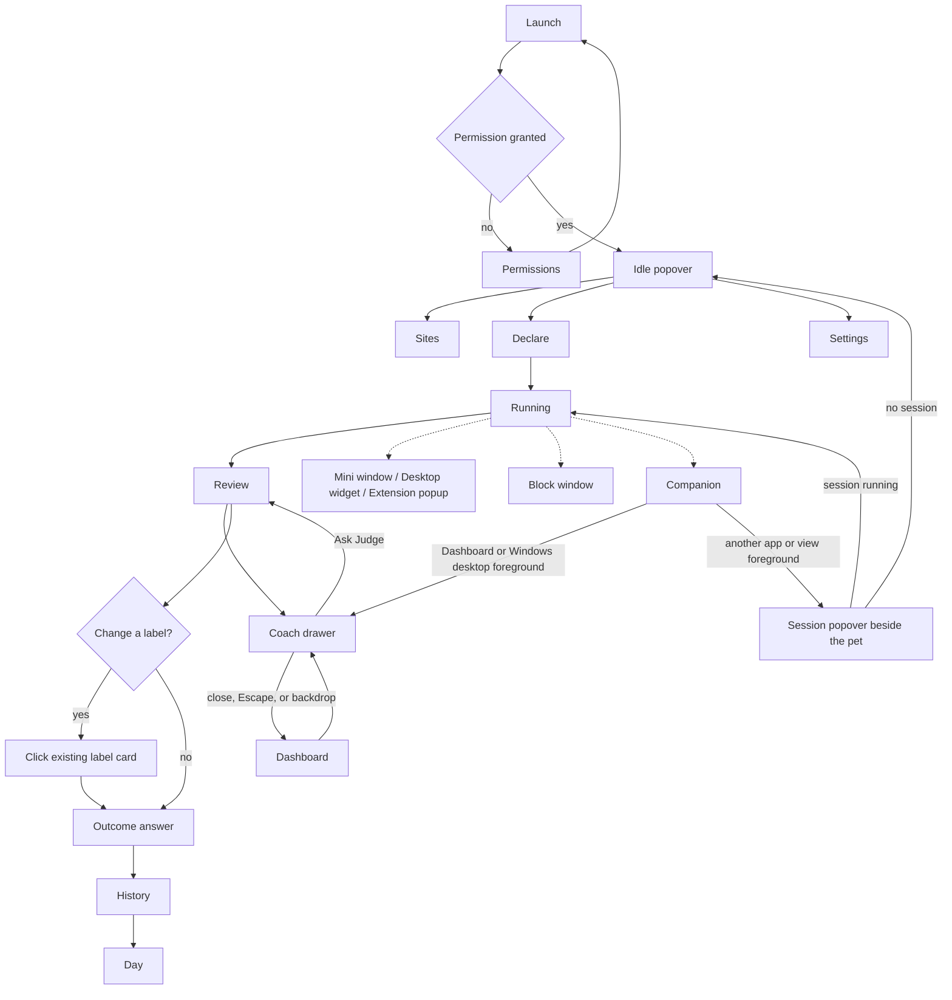

# Product — Twofold

> **Purpose:** the WHAT, for the team. Translates the brief into stories a build can be checked against.
> Traces back to: `idea.md` §6, §7, §8, §10. Traces forward to: design, system design, data model.

## 1. Product Purpose & Value Proposition

Twofold is for a self-employed person who works and gets distracted on the same computer. The public name is Twofold ([ADR-013](adr/ADR-013-display-name-twofold.md)). Code, storage, and IPC still say ledger. They say what they meant to finish. The app records the windows they actually used. The review puts those two side by side so the gap can be noticed. The question of whether they finished is asked and stored, and it is not the goal. Awareness is. Accountability loses where they conflict ([ADR-008](adr/ADR-008-awareness-over-accountability.md)). An on-device model judges only the windows they did not already classify. The title stays on the machine.

The one-sentence form is [`idea.md` §6](../idea.md). This paragraph is the only longer form.

**Success is measured by** the activation, retention, and value targets in [`idea.md` §8](../idea.md).

## 2. Personas

| Persona | Role & context | Problem frequency | Today's workaround | Stories |
|---------|----------------|-------------------|--------------------|---------|
| Worker | Self-employed, own laptop, own card. Work and distraction on that machine. The same stories cover people with the same behavior and no card. v1 does not paywall them. | End of a work block, on a typical workday | Memory, a timer, or a site blocker | US-001, US-002, US-003, US-004, US-005, US-006, US-007, US-008, US-010 |
| Builder | One of the three teammates, using Ledger on their own machine while building it | Daily during the hackathon, then whenever they dogfood | Reading logs | US-009 |

Employers and managers are not a persona. [`idea.md` §10](../idea.md) excludes them.

This cycle the team proves the loop on Windows first ([ADR-007](adr/ADR-007-windows-first.md)). The later buyer is a solo maker on an Apple Silicon Mac. That is not a second persona, and it has no story yet.

## 3. Feature Set & Priority

IDs and MoSCoW tiers match [`idea.md` §7](../idea.md). Nothing here adds an ID.

| `F-###` | Feature | Priority | Solves (problem) | Notes / why not |
|---------|---------|----------|------------------|-----------------|
| F-001 | Declare the intention and today's work and distraction list. Start immediately. | Must | The review needs the sentence. | |
| F-002 | Record the frontmost app, title, URL when available, and time away. | Must | Otherwise the answer comes from memory. | |
| F-003 | Judge in harness order. Rules, then memory, then System One. Store source, label, and confidence. No reason. | Must | The model alone mislabeled the probe. See [ADR-002](adr/ADR-002-harness-order.md) and [ADR-011](adr/ADR-011-coach-companion-and-system-one.md). | |
| F-004 | Review the session so the gap can be noticed. The finish question is secondary. | Must | The training loop in [`idea.md` §1](../idea.md). | |
| F-005 | Memory from repeated taps. One tap does not become memory. | Must | The second session has to show a skipped model call. | |
| F-006 | History. Day is a timeline. Month is rows. | Should | Pattern lags behind a single review. | The Attention breakdown may use the duration-composition double ring in [ADR-021](adr/ADR-021-attention-breakdown-card.md): raw durations only, with no percentages, scores, trends, breaks, or hours headline. |
| F-007 | Privacy panel, drop memory, delete the local file. | Must | The local claim has to be inspectable. | |
| F-008 | Eval set, precision only from a run. | Must | A claimed accuracy with no run fails the event. | |
| F-009 | Block today's sites and apps. Record the reach, not a duration. | Should | The popup asks what to block. | Work list and a host named in the intention are never blocked. See [ADR-012](adr/ADR-012-meant-loop-on-device.md). |
| F-010 | In-session drift signal. | Won't | A wrong flag would interrupt the block. | See [ADR-001](adr/ADR-001-silent-review.md). |
| F-011 | Coach, after the session, from this block and the local record. A suggestion needs a button. | Should | The record is the gap. A suggested action must be one the app can perform (ADR-012). | See [ADR-014](adr/ADR-014-coach-reads-the-local-record.md), [ADR-023](adr/ADR-023-explicit-local-coach-chat.md), and [ADR-024](adr/ADR-024-coach-drawer-over-dashboard.md). |
| F-012 | Account and sync. | Won't | An account is a network surface. | See [`idea.md` §7](../idea.md). |
| F-013 | Score, rate, streak, or hours headline. | Won't | That number is what a manager would want. | See [`idea.md` §7](../idea.md). |
| F-014 | Desktop companion. The coach's character. Drag and hover; tap opens Coach when the Dashboard or Windows desktop is foreground, or session controls for every other foreground app or view. | Should | A shortcut that routes by foreground context. | Coach opens only from the Dashboard or Windows desktop; other foreground apps and Twofold views open session controls. See [ADR-022](adr/ADR-022-companion-destination-follows-foreground.md). |
| F-015 | Cycle, phase mark, and the popup asking when time ends. | Should | The block needs a length, and the question has to appear. | No dial. See [ADR-012](adr/ADR-012-meant-loop-on-device.md). |
| F-016 | Saved work list and block list. The popup can change today only. | Should | The same sites should not be retyped every block. | |
| F-017 | Presets from the intention. Keyword first. Local model may pick a preset id only. | Should | The block list should follow the sentence. | Start does not wait. |
| F-018 | Switches for judge, coach, and companion. | Should | The loop has to run with the model off. | |

| Tier | Means | QA obligation |
|------|-------|----------------|
| **Must** | No point shipping without it | At least one test case, once `tests.md` exists |
| **Should** | The review still works without it for one release | At least one test case |
| **Could** | None in this set | — |
| **Won't** | Decided against for now | No story and no test |

## 4. User Stories & Acceptance Criteria

Story priority is Must or Should. A Won't feature has no story. No story is stricter than its feature.

**US-001 — Declare and start** *(F-001)* — Priority: Must
> As a **Worker**, I want to write what I intend to finish and start, so that the session is not waiting on a model.

- Given the popover is open and the capture permission is granted, when I enter an intention and press Start, then a session row exists with that text and a start time, and the running screen is up before any model call.
- Given the intention field is empty, when I press Start, then the session still starts and stores an empty intention; the review makes no intention comparison, declared-list matches retain their labels, and other attention visits default to Drift unless I correct them.
- Given the network is blocked, when I open the idle popover, then the local Start, History, and Privacy actions remain available and the network state is stated accurately; no session data is fabricated.
- Given a session is running, when I open the browser extension popup, then it shows only the intention and elapsed clock, without live labels, warning colors, or a progress gauge.
- Given no session is running and an ended session exists, when I open the browser extension popup, then it shows the latest session's actual local record and offers Yes or Not yet if unanswered; its History and Open Twofold actions launch the corresponding desktop route through the local native host.
- Given the native host is unavailable, when I open the browser extension popup, then it states that the local app is unavailable and offers Open Twofold; it does not imply a network connection.
- Given no session is running, when I enter an intention and targets in the extension and press Start, then the desktop's canonical start path creates one session row and begins capture; an empty intention remains allowed and the model does not gate the start.
- Given a session is running, when I edit its intention in the desktop or extension and save, then the same session row is updated without starting another session; its existing visits and verdicts remain attached. Cancel restores the last saved text, and an empty intention can be saved.
- Given I choose History, Review, or Privacy in the extension, when the native host is available, then the desktop opens that matching screen for the local record.

**US-002 — Record attention** *(F-002)* — Priority: Must
> As a **Worker**, I want the session to record where the machine was, so that the review is not my memory of the block.

- Given a session is running, when the frontmost app or window changes, then the previous visit is closed with its app name and the elapsed interval, and a new visit opens.
- Given the machine goes idle, when activity resumes, then the idle interval is stored as away rather than as attention on the last window.
- Given the capture permission is missing, when a session is running, then visits are not invented, and the review names the gap.
- Given a visit receives a verdict while the session is still running, when I look at the running screen, then the verdict is not on it.

**US-003 — Judge the residual** *(F-003)* — Priority: Must
> As a **Worker**, I want each visit labeled by the cheapest source that already knows it, so that the model is only asked about windows I did not classify.

- Given a visit's app or site is on this session's work or distraction list, when the visit closes, then the verdict source is rule, and no model call is recorded for it.
- Given the visit matches memory, when the visit closes, then the verdict source is memory, and no model call is recorded for it.
- Given the visit matches neither, when the model returns, then the verdict source is model and the label is serves, drifts, or unclear.
- Given the model returns anything else, times out, or is not loaded, when the visit is judged, then the label is unclear and the session keeps running.

**US-004 — Review the block** *(F-004)* — Priority: Must
> As a **Worker**, I want the intention beside the windows I used, so that I can notice what the block was.

- Given a session has ended, when the review opens, then the intention, each visit's app, the away total, and each verdict's label and source are the body of the screen. The finish question is on the screen and is not the headline.
- Given the current session has ended, when its review opens, then it puts the exact intention beside recorded host visits, elapsed minutes, away intervals, and blocked reaches, and places “Did you finish?” with equal-weight Yes and Not yet choices after that evidence.
- Given an ended session is open in Review or the extension, when I edit and save its intention, then the same session and review row are updated; stored verdicts, user corrections, visits, and outcome remain intact. Unresolved review fallback uses the saved intention, without rerunning model judgment or adding a memory vote.
- Given an ended session has an answer, when I change or clear it in Review or the extension, then the same row stores the new answer or `unanswered`, respectively.
- Given I answer yes or not yet, when the review closes, then the session stores that outcome, and nothing on the screen praises or scolds it.
- Given I close the review without answering, when I next open history, then the session's outcome is unanswered.
- Given a captured attention visit has an unclear, pending, or gated raw verdict, when the review renders, then the local if/else fallback supplies Served or Drift without asking me to classify it. Away and capture gaps keep separate states. The quality bar remains owned by idea.md section 9.

**US-005 — Correct a visit label** *(F-004, F-005)* — Priority: Must
> As a **Worker**, I want one tap on a visit I recognize, so that the record uses my word for it.

- Given a review visit shows Served or Drift, when I click its existing label card, then it switches to the other label and persists through `review.tap` as source user, separately from the automatic display fallback.
- Given I correct a label, when I reopen the review, then the saved user label and user source are shown. Enter or Space on the focused label card performs the same correction.
- Given an ended attention visit is shown in the extension, when I tap its Served/Drift label, then the shared review correction path saves source `user` and applies the existing distinct-visit memory rule.
- Given this is the first tap for that app or site, when the next session visits it, then memory does not supply the label.

**US-006 — Skip a remembered window** *(F-005)* — Priority: Must
> As a **Worker**, I want a repeated label to stick, so that the model is not asked again about a window I have already settled.

- Given two distinct visits have been tapped with the same label for an app or site and no later conflict or forget occurred, when a later visit matches it without a rule match, then the verdict source is memory and the model call count does not increase.
- Given only one visit supports a key, when I repeat its same-label tap, then it still supplies only one contribution and a later visit is not labeled by memory.
- Given a key has remembered support, when I tap a conflicting label, then that visit uses my new label, earlier visits keep their historical labels, and a later visit does not use memory until another distinct visit supports the new label.
- Given support was reset by a conflict or forgotten, when I tap two previously used distinct visits with the same label again, then a later matching residual visit uses memory.

**US-007 — See the pattern as rows** *(F-006)* — Priority: Should
> As a **Worker**, I want past sessions listed, so that a repetition can be noticed after it has happened more than once.

- Given one ended session, when I open history, then that session is listed and the screen states no pattern.
- Given the same app appears in two or more sessions, when I open history, then I can see that repetition in the rows. The screen does not add a sentence that interprets it.
- Given any data, when history renders, then counts are words, and it shows no score, no rate, no streak, and no hours headline.
- Given sessions on one day, when I open the day view, then those sessions are in time order on one trace.
- Given sessions across days, when I open the month view, then the rows are grouped by day, and any Attention breakdown uses the duration-composition double ring specified below without percentages.
- Given a session has recorded durations, when I view its Attention breakdown, then the double ring shows raw durations only: the outer ring separates Attention, Away, and Not recorded; the inner ring separates Served, Drifted, Unclear, and Labelling; the center shows `windowMs`, the total recorded attention duration regardless of verdict. It shows no percentages, scores, trends, or breaks.

**US-008 — See what stayed on the machine** *(F-007)* — Priority: Must
> As a **Worker**, I want to see what the app ran and where the file is, so that I can check the privacy claim.

- Given any session history, when I open the privacy panel, then it shows the count of verdicts whose source is model, the count of coach turns, the model id or the fact that none is configured, and a statement that this build has no network client.
- Given I drop memory, when the panel confirms, then memory rows are gone and past visits keep their verdict labels; tapping the same distinct visits again can teach memory.
- Given a judgment is pending, when I delete the local file successfully, then sessions and the file are gone, and a late model result cannot recreate them or write into a replacement Store.
- Given file deletion is retrying a transient lock, when another data operation is requested, then it rejects until deletion finishes; duplicate delete requests share the same operation.
- Given the file remains locked after the deletion attempts, when deletion fails, then the operation reports "Delete failed, file still present" rather than confirming success, and other data operations are available again.
- Given I end a session while judgment is pending without deleting its data, when the judgment finishes, then the ended session's review receives the verdict.

The panel does not measure packets. A judge who wants byte counts uses a monitor outside the app. The panel will not notice a dependency that phones home.

**US-009 — Report precision from a run** *(F-008)* — Priority: Must
> As a **Builder**, I want the eval printed from a run against labeled windows, so that a demo cannot quote a number the set did not produce.

- Given the eval set has at least one case, when I run it, then the output counts how many asserted labels matched the expected label, split by verdict source.
- Given a case has not been run, when a screen shows precision, then it shows that the set has not been run, rather than a number.

**US-010 — Say what was not seen** *(F-002, F-004)* — Priority: Must
> As a **Worker**, I want the review to name time it did not capture, so that a short trace is not described as the whole block.

- Given the session's wall clock is longer than the sum of visit intervals, when the review opens, then it states the unrecorded duration and does not assign that duration to a window.
- Given a sleep or capture-failure gap has closed the last visit, when the next captured tick reports idle or locked, then the new away visit starts at that tick, and the gap remains unrecorded rather than becoming away time.

**US-011 — Ask the coach after the block** *(F-011)* — Priority: Should
> As a **Worker**, I want to ask about a block that has ended, so that I can talk through its local record without a lecture.

- Given conversation history is loading or has failed, when I type into the composer, then my draft remains editable and a failed history read offers Retry without discarding the draft (ADR-025).
- Given an older database stores conversation text under `text`, when the app opens that record, then it preserves the saved turns and reads them using the canonical `content` field (ADR-025).

- Given a session has ended and Coach is ready, when I enter a message and press Send, then the existing on-device node-llama-cpp / Qwen3.5-2B runtime replies from app-computed figures for that session and allowed local-history counts, and the user message and reply are stored locally.
- Given I open Coach from the Dashboard, Review, or companion, when the drawer appears, then it fills the right side of the window over a dimmed and blurred inert Dashboard, with the mascot, Twofold Coach title, Local record indicator, Working on intention, saved conversation, question chips, and composer.
- Given I click a suggested question chip, when Coach is open, then its text fills the composer draft and no model call starts until I press Send.
- Given Coach is open, when I choose Ask Judge, then the latest ended session's Review opens.
- Given Coach is open, when I press Escape, click the close control, or click the backdrop, then the drawer closes to the Dashboard without sending the draft or a message.
- Given I open Review, Coach, or tap the companion, when no message has been sent, then no model call or unsolicited focus prompt is generated.
- Given the model is loading or unavailable, when I try to send a message, then Coach states the actual loading or unavailable state, preserves the typed message, and does not substitute a fabricated reply; Review remains usable.
- Given a session is running, when I look at the running screen or companion session popup, then Coach has nothing to say there.
- Given a session has ended, when I open Coach, then it opens the latest ended session; each request includes that session's computed figures and allowed counts and repeat-reach facts from local history, with a bounded recent conversation for that session.
- Given a session has ended with recorded visits, when I ask Coach about app use, then its evidence includes per-app durations summed from recorded visit intervals and leaves unrecorded gaps unassigned (ADR-026).
- Given more than the allowed conversation bound has been saved for a session, when another exchange is saved, then only the newest complete exchanges remain in that session's local conversation.
- Given the reply contains a number that was not in the computed context or an allowed verified corpus claim, when it would be shown, then the reply is rejected and the screen says the coach could not answer from the record.
- Given I answered yes or not yet, when the coach replies, then it does not praise yes and does not scold not yet.
- Given the coach proposes an action outside ADR-014's permitted set, when the reply is shown, then the unsupported action is omitted; the coach does not present an action as a button unless the app can perform it.
- Given this is the first session, when I ask the coach, then history counts are empty and the reply still uses the block just ended.
- Given I ask "Where did my time go?", when the coach replies, then it shows computed app durations, away time, and unrecorded time without asking the model to calculate them; any apps beyond the twenty shown are included in an other-app total.
- Given the coach is waiting for model readiness, when I delete the local file, then the request is drained and cannot generate or persist a late reply or recreate the file.
**US-012 — Keep the coach's character on the desktop** *(F-014, F-011)* — Priority: Should
> As a **Worker**, I want the companion on the desktop, so that I can move it and open my current session controls and log.

- Given the app is open, when I drag the companion, then it follows the pointer, and a drag does not open the popup and does not write a label.
- Given the Dashboard or Windows desktop (`Program Manager`) is foreground, when I tap the companion, then Coach opens for the latest ended session, with an empty state if no ended session is available.
- Given any other app or Twofold view is foreground, when I tap the companion, then the existing shared 320×420 session popover opens beside it on Running or Idle according to session state, with available controls and local session log; Running shows no live verdicts.
- Given the session popover is open from the companion, when it loses focus, then the popover dismisses and the companion remains at its saved position.
- Given a session has ended, when I want to ask the coach about it, then I can open the coach from that session's Review.
- Given any outcome and any verdicts, when the companion is drawn, then it looks the same.

**US-013 — Block what I named** *(F-009)* — Priority: Should
> As a **Worker**, I want a named site or app to stop while the block runs, so that the list is a brake and the review still shows that I reached for it.

- Given a session is running and the frontmost app is on today's block list and not on today's work list, when it comes to the front, then a desktop app is hidden, the block window shows the intention and "That's still true.", and a hit is stored with no duration.
- Given the target is a site and the extension is installed, when I open that site, then the page is replaced and the hit has no duration.
- Given the target is on today's work list, or the intention names that host, when I open it, then it is not blocked.
- Given the session is in a break, when a blocked target comes to the front, then it is still blocked and the judge does not run.
- Given the session has ended, when the review opens, then each hit is listed as a reach and is not given a duration on a window.

**US-014 — Give the block a length** *(F-015)* — Priority: Should
> As a **Worker**, I want a work and break length, so that the question shows up when the work ends.

- Given I pick `25 work · 5 break` and two cycles, when I press Start, then the session length is 55 minutes and it ends after the second work period.
- Given a timed session reaches its end, when I have not pressed End, then the popup comes forward and asks whether I finished, and the tray shows `?` until I answer or dismiss.
- Given I press End in the popup, when the session stops, then the question is on that popup and a second popup does not open.
- Given the phase changes, when I look at the tray, then it says work or break, with no countdown and no color.

**US-015 — Keep my lists** *(F-016)* — Priority: Should
> As a **Worker**, I want my sites saved, so that today's popup starts from them.

- Given I saved a work list and a block list, when I open the popup, then those chips are filled in.
- Given I remove a chip and start, when the next day opens the popup, then the saved list still has that chip. This session does not.

**US-016 — Fill the block list from the sentence** *(F-017)* — Priority: Should
> As a **Worker**, I want the sentence to suggest what to block, so that I do not assemble the list by hand every time.

- Given the intention contains a whole word from the writing preset, and I have not edited a chip, when the popup fills, then the writing block list is merged in and YouTube is not given a pass that the writing preset does not have.
- Given the intention names instagram.com, when the chips fill, then Instagram is not on the block list.
- Given no keyword matches, when the local model answers, then the answer is one preset id or none, and it is not a site name.
- Given I press Start before that answer returns, when the session starts, then it starts from the saved list and the late answer is dropped.

**US-017 — Turn a piece off** *(F-018)* — Priority: Should
> As a **Worker**, I want to turn the judge, the coach, or the companion off, so that the rest of the loop still runs.

- Given the judge is off, when a visit matches neither a rule nor memory, then the label is unclear and the model is not called.
- Given the coach is off, when a session has ended, then the coach is not shown.
- Given the companion is off, when the app is open, then the pet is not shown.
- Given any of those are off, when a session runs, then capture, blocking, and the review still work.

### 4.1 Cross-cutting rules (`BR-###`)

| `BR-###` | Rule | Invoked by |
|----------|------|------------|
| BR-001 | While a session is running, the UI shows the intention and the clock. It does not show a verdict, a warning, or praise. | US-001, US-002, US-004, US-011, US-012 |
| BR-002 | The outcome answer does not change the running UI. The review and the history do not praise yes or scold not yet. | US-004, US-007, US-011, US-012 |
| BR-007 | Where accountability would change what the person sees, the screen shows the record instead. The finish answer is stored and is not the headline. | US-004, US-007 |
| BR-003 | A model result that is not serves, drifts, or unclear is stored as unclear. A missing model is the same result. | US-003, US-004 |
| BR-004 | Memory supplies a label only after the same app or site was tapped on more than one visit. | US-005, US-006, US-012 |
| BR-005 | Window titles and URLs are written only to the local store. No story sends them to a network client, because this build does not have one. | US-002, US-003, US-008 |
| BR-006 | No screen shows a productivity score, a rate, a streak, or an hours headline. | US-004, US-007, US-011 |

## 5. App Flow & UX Intent

**Design reference:** [`design.md`](design.md). Visual stack: Electron with React through Vite + `vite-plugin-electron` ([ADR-006](adr/ADR-006-template-vite-build.md)). This inventory describes required product screens, not their implementation status; see the README for what runs today.

### 5.1 Screen Inventory

| Screen | Purpose | Entry points | States to design |
|--------|---------|--------------|------------------|
| Permissions | Explain the capture prompt and what fails without it (US-002) | First launch, or a session start while permission is denied | granted / denied / not-yet-asked |
| Idle popover | Start a session or open history and the privacy panel (US-001) | Menu-bar click while no session runs | empty history / has history / network blocked |
| Declare | Write the intention and today's lists (US-001) | Start from the idle popover | empty intention / filled / permission missing |
| Running | Show the intention and the clock until the session ends (US-001, BR-001) | After Start | running / capture failing |
| Review | Read the record, correct a label when needed, answer the question (US-004, US-005, US-010) | Session end | loading the record / ready / unanswered on dismiss |
| History | Month of sessions as rows (US-007) | Idle popover | empty / one session / repeated app |
| Day | That day's sessions on one trace (US-007) | History, or the tray | empty / one or more sessions |
| Sites | Saved work list and block list (US-015) | Popup, settings | empty / filled |
| Block window | Intention and "That's still true." (US-013) | A blocked app or site comes to the front | site / app |
| Settings | Judge, coach, and companion switches (US-017) | Privacy | all on / one off |
| Privacy | Calls, model id, drop memory, delete file (US-008) | Idle popover, and the review | ready / confirm drop / confirm delete |
| Mini window | Always-on-top clock and intention display (US-001, BR-001) | Toggle from tray or shortcut | running / no session |
| Companion | The coach's character on the desktop (US-012) | Present while the app is open | idle / dragging / Twofold foreground / another app or view foreground |
| Coach | Ask about one ended session in a full-height right drawer over the inert Dashboard (US-011) | Dashboard, Review, or companion from Dashboard/Windows desktop | no ended session / model loading / ready / unavailable / replying / saved conversation / could not answer / dismissing |
| Desktop widget | Display-only desktop layer widget on macOS (US-001, BR-001) | Automatic while session runs | running / no session |
| Extension popup | Start, edit intention, quiet running status, latest ended-session summary, finish and label actions (US-001, US-004, US-005, BR-001) | Click extension icon in browser | idle / editing / running / ended session / native host unavailable |

### 5.2 App Flow

**Demo path.** One block, in this order, and only the steps the build can show. Type "finish the client pitch deck". The writing preset fills the block list. A window on the work list is serves, from the list. A blocked app is a reach with no duration. One window on neither list receives an automatic Served or Drift label; clicking its existing label card switches it if the person disagrees. The review shows each label's source. The coach saves a reply grounded in the ended session and local history. Any action is shown only when the build can perform it. The privacy panel shows the model id and that this build has no network client. A step that is not in the build is skipped, not described as if it ran. See [ADR-014](adr/ADR-014-coach-reads-the-local-record.md) and [ADR-024](adr/ADR-024-coach-drawer-over-dashboard.md).

**Linear (primary path):**

Permissions, if needed, then Idle popover, then Declare, then Running, then Review, then History.

**Branching:**

**Flow annotations:**

| Flow concern | Detail |
|--------------|--------|
| Entry points | Menu-bar click. No account link, no deep link, no second device. |
| Decision branches | Permission gates capture. Every captured attention label card allows an optional correction. The outcome can be skipped, which stores unanswered. |
| Dead ends | None. Permissions returns to launch. Delete in the privacy panel returns to an empty idle popover. |
| Abandonment / resume | Visits already written stay in the local file if the app quits. Closing the review without an answer stores unanswered. An open visit is closed at the last timestamp the app managed to write. |
| Edge cases | Empty intention still starts (US-001). Permission denied records a gap (US-002). Model missing retains raw unclear (US-003) and uses the local binary review fallback. URL unavailable leaves the URL empty and still stores the app and title. |

### 5.3 Onboarding Flow

- **Aha / first-value moment:** the first review, with the intention beside windows the person recognizes.
- **Time-to-first-value target:** not numbered. No measured setup time exists. The path is one permission prompt, one sentence, one work block, then the review.
- **Skippable / resumable:** the permission step is not skippable if they want capture. The outcome answer is skippable and then counts as unanswered.
- **Friction budget:** the OS permission prompt and the intention field. No account. The 1.28 GB model file is fetched once at setup, not at first launch of a session ([ADR-003](adr/ADR-003-electron-and-node-llama-cpp.md)).

### 5.4 UX Constraints

- Start does not wait on the model. The session row is written before any model call (US-001).
- A shown verdict names its source. The review reads `source` off the verdict row (US-004).
- The running screen has no verdict on it (BR-001). The running view simply does not bind that column.
- Counts in history are words (US-007). The formatter has no percent and no hours headline (BR-006). The finish count is not the headline (BR-007).

### 5.5 Instrumentation & Event Taxonomy

These are the rows the product already stores. There is no third-party analytics tool. Properties are ids and enums. Titles and URLs stay on the visit row and are not copied into a second log.

| Event name | Fires when | Key properties | Feeds metric |
|------------|-----------|----------------|--------------|
| `session_started` | Start is pressed | session id, intention empty or not | [`idea.md` §8](../idea.md) activation and intention share |
| `session_ended` | The session closes | session id, outcome or unanswered | Stored. Not a target. [`idea.md` §8](../idea.md) says the finished share is not a goal |
| `verdict_recorded` | A visit receives a label | visit id, source, label | F-008 precision by source, and the privacy panel's model-call count |
| `memory_applied` | A visit is labeled from memory | visit id, memory id | The second-run check in US-006 |

## 6. Non-Goals

Scope exclusions for whole populations and products are in [`idea.md` §10](../idea.md).

- Do not add a cloud model as a fallback when the local one is slow. The review has to finish offline. Revisit only for a feature that is labeled online and is not on the path of F-004.
- Do not polish macOS or Linux capture in this cycle. The development target is Windows. Revisit only if that path is stable and time remains ([ADR-007](adr/ADR-007-windows-first.md), [`idea.md` §10](../idea.md)).
- Rejected features F-010, F-012, and F-013 stay in §3. F-009 is the blocker. It is Should. F-011 is the coach. It is Should.

## 7. Dependencies & Open Questions

**Dependencies**

- An OS permission that yields the frontmost app and window title. Without it, US-002's gap state is the product.
- A local model runtime: node-llama-cpp with Qwen3.5-2B, resolved in [ADR-003](adr/ADR-003-electron-and-node-llama-cpp.md).
- No hosted database and no account service. F-012 is Won't.

**Open questions**

- Which app shell and which model runtime. Resolved: Electron 44 + TypeScript + React (Vite + `vite-plugin-electron`), with node-llama-cpp running Qwen3.5-2B locally. See [ADR-003](adr/ADR-003-electron-and-node-llama-cpp.md) and [ADR-006](adr/ADR-006-template-vite-build.md).
- How the active browser URL is read, and on which browsers. Resolved: Windows (x-win UIA), macOS (x-win AppleScript), Linux (Chromium MV3 native messaging extension relay). See [ADR-004](adr/ADR-004-three-os-and-three-frontends.md).
- Memory's minimum support is two distinct visits for the current label, with no higher floor. Conflict and forget release contributions so visits can reteach (US-006; [ADR-010](adr/ADR-010-backend-work-ownership.md)).
- Whether old window titles are kept until the user deletes the file. `[assumption]` kept, because US-004 on a past session needs them. Revisit if the file grows past what the demo machine tolerates. No size number exists yet.
- Residual-model accuracy remains a risk. F-008 has an authored evaluation run, including probe overlap, not blind independent validation; provenance and results live in [system-design §9](system-design.md#τ-eval). The raw model display gate uses the precision bar owned by idea.md section 9, never a second target here. [ADR-017](adr/ADR-017-binary-review-label-correction.md) supplies a binary fallback for the review.

## 8. Doc Integrity Check

- [x] Every `F-###` here exists in [`idea.md` §7](../idea.md) with the same ID and the same MoSCoW tier.
- [x] Every `US-###` names at least one real `F-###`, and every Must or Should feature has a story.
- [x] Every story priority is Must or Should, and none is stricter than its feature.
- [x] Every story has at least one Given/When/Then, and each result is observable.
- [x] Each persona has a story, and each story names a persona from §2.
- [x] Each `BR-###` is invoked by at least two stories.
- [x] Every screen in §5.1 appears in the §5.2 flow, and names its states.
- [x] Metrics, routes, and the 0.80 bar are links to their owners, not a second copy of the target.
- [x] Residual-model accuracy remains the load-bearing risk in §7; the authored F-008 run and its limitations are linked to their owner.

## References

- [`idea.md`](../idea.md)
- [`docs/index.md`](index.md)
- [`design.md`](design.md)
- [`system-design.md`](system-design.md)
- [`data-model.md`](data-model.md)
- [ADR-001](adr/ADR-001-silent-review.md), [ADR-002](adr/ADR-002-harness-order.md), [ADR-003](adr/ADR-003-electron-and-node-llama-cpp.md), [ADR-004](adr/ADR-004-three-os-and-three-frontends.md), [ADR-006](adr/ADR-006-template-vite-build.md), [ADR-007](adr/ADR-007-windows-first.md), [ADR-008](adr/ADR-008-awareness-over-accountability.md), [ADR-011](adr/ADR-011-coach-companion-and-system-one.md), [ADR-012](adr/ADR-012-meant-loop-on-device.md), [ADR-013](adr/ADR-013-display-name-twofold.md), [ADR-014](adr/ADR-014-coach-reads-the-local-record.md), [ADR-022](adr/ADR-022-companion-destination-follows-foreground.md), [ADR-023](adr/ADR-023-explicit-local-coach-chat.md), [ADR-024](adr/ADR-024-coach-drawer-over-dashboard.md)
