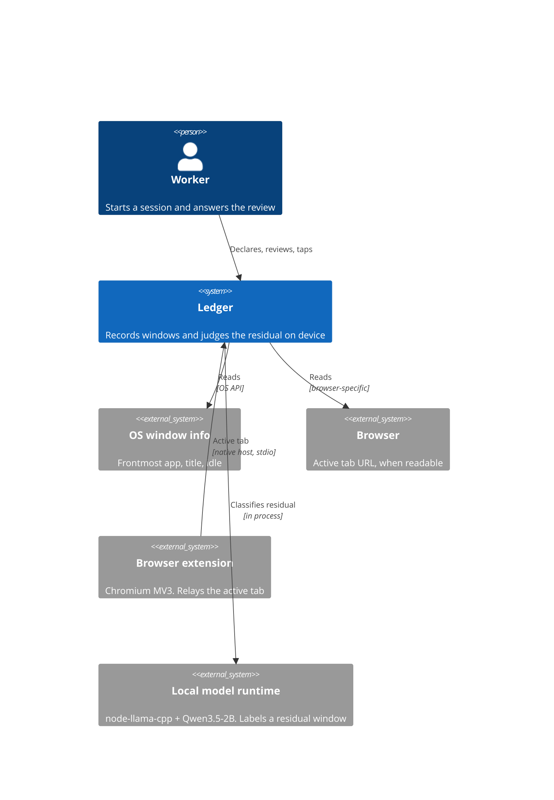
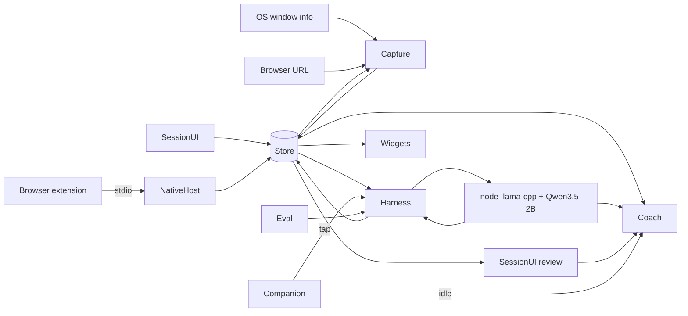

# System Design — Ledger

> **Purpose:** the HOW, at component level. Feature behavior stays in [`prd.md`](prd.md). Field types stay in [`data-model.md`](data-model.md).

## 1. System Context



The boundary is the machine. There is no account server and no model API on the network. A failure of `oswin`, `browser`, `extension`, or `runtime` is ours to show. A failure of the public internet is not on the path of the review.

## 2. Components & Responsibilities

| Component | Responsibility | Owns | Depends on | Serves |
|-----------|----------------|------|------------|--------|
| SessionUI | Declare, running, review, ledger, privacy | The outcome answer, and nothing about how a visit is split | Store | F-001, F-004, F-006, F-007 |
| Capture | Open and close visits, mark away, record gaps | Visit boundaries | OS window info, browser URL | F-002 |
| Harness | Apply rules, then memory, then the model. Accept taps. | Verdicts and memory rows | Store, Capture, local model runtime | F-003, F-005 |
| Eval | Run labeled fixtures through Harness and count matches by source | Eval-case results | Harness | F-008 |
| Store | Read and write the local file | The file and its transactions, not the meaning of a row | The disk | F-001, F-002, F-003, F-004, F-005, F-006, F-007, F-008 |
| NativeHost | Relay the active tab and session status between the extension and Store | Nothing | Store, browser extension | F-002, F-001 |
| Widgets | Tray, mini window, desktop layer. Show the running session. | Nothing. Reads the session only. | Store | F-001 |
| Coach | Talk about one ended session, from figures Store already has. | Coach turns. Not verdicts. | Store, local model runtime | F-011 |
| Companion | The pet. Drag, hover, tap. While a session runs, the popup is the running view plus "This isn't the work". | The pet's position. A tap goes to Harness. | Store, Harness, Coach | F-014, F-011 |

SessionUI does not write verdicts. A tap goes to Harness, including "This isn't the work" on the companion. Eval does not write user visits. Fixtures stay in the eval set. Widgets, the companion, and the extension popup never show verdicts. The coach does not run while a session is open.

## 3. Data Flow



Titles and URLs cross from the OS or the extension into Store and stop. The model runtime is on the same machine. The diagram has no edge that leaves the device.

## 4. Technology Choices & Trade-offs

| Choice | Why | Trade-off accepted | Alternative rejected | Authority |
|--------|-----|--------------------|----------------------|-----------|
| Desktop process, not a browser extension | An extension cannot see the other apps ([`idea.md` §4](../idea.md)) | We take an OS permission the extension never needed | Extension plus a web app, which is what MEANT was | Our judgment, from the problem |
| No network client in the build | The review has to work with the network gone, and titles must not leave ([`prd.md` BR-005](prd.md)) | No sync, no hosted backup | The prior project's hosted database and cloud model gateway | Hackathon hard requirement, plus F-012 |
| Harness order in [ADR-002](adr/ADR-002-harness-order.md) | The probe showed the model is wrong on an obvious window | Three sources to keep visible in the review | A model call on every window | Our judgment |
| Single file on the machine | One user, one computer, delete means delete the file | No multi-user and no remote restore | Hosted Postgres | Our judgment |
| Electron 44 + TypeScript + React (Vite + `vite-plugin-electron`, from the node-llama-cpp template), node-llama-cpp 3.22 in main, Qwen3.5-2B Q4_K_M from a local path | One codebase on Windows 10, macOS, and Linux Mint with no Rust toolchain; the runtime is in process, not a localhost server | Larger app; a 1.28 GB model file to fetch at setup | Tauri (Rust + MSVC, WebKitGTK); Ollama and llama-server (localhost HTTP); Phi Silica (Windows 11 only); Apple FoundationModels (second runtime); electron-vite (ADR-006) | [ADR-003](adr/ADR-003-electron-and-node-llama-cpp.md), [ADR-006](adr/ADR-006-template-vite-build.md), Bennett |
| Three OSes, three frontends: desktop app, widgets, Chromium MV3 extension with a stdio native host writing the same SQLite file; main process is the backend over IPC | The sketch maps onto one app with no localhost API; Linux gets a URL only through the extension | Native host to install per browser; Firefox and Safari have no extension | Localhost HTTP backend; WidgetKit (needs a Team ID) | [ADR-004](adr/ADR-004-three-os-and-three-frontends.md), Bennett |
| Model stage = System One `decide()` on Qwen3.5-2B, gated by τ. The coach is a separate chat on that same model, after the session. | One model, one runtime. A label stays a label. Prose has its own surface. | The judge no longer writes a reason. τ still hides a weak label. | The ADR-005 agreement pass, which put the small model's prose inside the verdict. Laya, Kev, GLiNER, Jev, embedding filter. | [ADR-011](adr/ADR-011-coach-companion-and-system-one.md). ADR-005 still holds for `decide()` and τ. |
| Backend work belongs to a Store generation; learning votes belong to current memory support, not lifetime tap history | Delete/quit must invalidate late work; conflict/forget must allow reteaching without erasing history | Pending judgments are discarded on delete/quit; old unidentifiable support is reset by migration | Let late work reopen any Store; lifetime visit deduplication or a permanent tap ledger | [ADR-010](adr/ADR-010-backend-work-ownership.md), Bennett |

The probe, so it is not mistaken for a budget. On 2026-10-09, `SystemLanguageModel` on an M4, 16 GB, macOS 26.5, answered in 3.89 seconds cold and about 0.2 seconds warm, and was wrong on 2 of 4 windows. n=4. One machine. Not a latency target and not a precision result.

## 5. Integration Points

| Service | Protocol | Failure mode | Our behaviour on failure |
|---------|----------|--------------|--------------------------|
| OS window info | `@miniben90/x-win` poll, Electron `powerMonitor` | Permission denied or the API returns nothing | Capture writes no invented visit. The review states the gap (US-002). |
| Browser URL | Windows: x-win (UIA, Firefox included). macOS: x-win (AppleScript, no Firefox). Linux: browser extension only. | URL not readable for that browser | The visit keeps app and title. URL stays empty. Harness may return unclear. |
| Native messaging | Chrome/Edge/Brave native host, stdio, length-framed JSON | Extension or host missing, incognito, or browser closed | URL comes from x-win, or stays empty. Capture does not wait. |
| Desktop widget file | `widget.txt` in the Ledger dir, read by xfce4-genmon (Linux) | File absent or stale | Genmon shows "Ledger idle". Nothing else depends on it. |
| Local model runtime | In-process node-llama-cpp call | Model file missing, out of memory, timeout, or a string outside the three labels | Harness stores unclear and does not block Capture or End (US-003, BR-003). |
| Network | None | Not applicable. This build does not open one. | Nothing in the review waits on it. A dependency that phones home is outside what the privacy panel can see (US-008). |

## 6. Deployment Topology

- One process on the user's computer. No server, no staging environment, no shared database between teammates.
- This cycle runs Windows from source. macOS/Linux delivery and native-host installation are deferred under [ADR-007](adr/ADR-007-windows-first.md); the cross-platform design below is not a delivery claim.
- Supported matrix. Latencies are **estimates** scaled from llama.cpp benchmarks; the smoke spikes replace them with measurements.

| Tier | Spec | Est. S1 decide | Est. S1 + S2 per residual visit |
|---|---|---|---|
| Minimum | x64 CPU with AVX2 or Apple Silicon M1+, 8 GB RAM, 3 GB free disk, CPU only | 1–3 s | 3–8 s |
| Recommended | 16 GB RAM plus a Vulkan GPU with ≥4 GB VRAM, or Apple M1+ with 16 GB | 0.1–0.5 s | 0.5–1.5 s |
| Bennett (A1000 4 GB, Vulkan) | Model ~1.3 GB + KV ~0.1 GB + overhead ~0.25 GB ≈ 1.65 GB of VRAM | **Measured** (spike O1, warm): 65–75 ms | **Measured** (spike O1, warm): 0.9–1.1 s |
| Alexandrei (M4 Metal) | Same footprint in unified memory | ~0.2–0.6 s | ~1 s |
| Alex (Mint) | Unknown until the spike | — | — |

- CPU-only laptops still work: verdicts are computed in a background queue and shown only at review (ADR-001). Rule and memory hits never reach the model.
- Not supported: Wayland sessions (x-win needs GNOME there); Intel Macs and ARM Windows/Linux (prebuilt binaries unverified); 32-bit systems.
- Judges reproduce from the repository README. Those instructions are owed before the 2026-10-10 10:00 Asia/Manila freeze.
- The factory in `fmd/` is not part of the product and is not in git.

## 7. Scaling Strategy & Non-Functional Risk

- **What scales, and how:** nothing across users. One file grows with visits. The harness skips the model when a rule or a memory row hits, which is the only volume control.
- **Which non-functional requirement is at risk under this design:** time from a window switch to a stored verdict, on a machine weaker than the probe machine. No `quality.md` exists, so there is no numeric budget to meet. The §6 latencies are estimates, and the §9 10 s per-visit timeout is a cut-off, not a target.

## 8. Doc Integrity Check

- [x] Each component names what it owns. SessionUI owns the outcome. Capture owns visit boundaries. Harness owns verdicts and memory. Eval owns eval results. Store owns the file. Coach owns coach turns. Companion owns the pet's position. NativeHost and Widgets own nothing.
- [x] Every Must and Should feature appears in §2. F-009, F-010, F-012, and F-013 are Won't and have no component. F-011 is Coach. F-014 is Companion.
- [x] Each technology row names a rejected alternative and an authority. The shell and runtime are chosen in ADR-003, not a silent default.
- [x] Each integration names a failure mode and the behavior.
- [x] There is no network-exposed surface to hand to a security doc. The native host speaks stdio; there is no localhost API.
- [x] Field types and the 0.80 bar are not restated as targets here. §9 refers to the bar in idea.md §9.
- [x] The inherited risk is model accuracy on the residual. It is named in §4 and is not treated as settled; τ hides model verdicts until an eval run qualifies one.

## 9. Build spec

### Module map

Layout of the `electron-typescript-react` template (Vite + `vite-plugin-electron`), Electron 44. `dist/` is the built renderer, `dist-electron/` the built main and preload.

- `electron/paths.ts`: `ledgerDir(): string`, `dbPath()`, `widgetFilePath()`.
  - Windows: `%APPDATA%\Ledger`. macOS: `~/Library/Application Support/Ledger`. Linux: `${XDG_CONFIG_HOME:-~/.config}/Ledger`.
  - Main uses this function and not `app.getPath`, so the native host resolves the same path.
  - DB: `ledger.db`. Widget file: `widget.txt`.
- `src/shared/types.ts`: `Label`, `Source`, `ModelStage`, `Route`, the row types (`Session`, `Visit`, `Verdict`, `ReviewVisit`, `Review`, `HistoryRow`, `Privacy`, `Permissions`) mirroring [`data-model.md`](data-model.md), and `LedgerApi` (the contract below). Imported by main, preload, and renderer.
- `electron/store/db.ts`: opens `node:sqlite` `DatabaseSync` with `PRAGMA journal_mode=WAL; PRAGMA busy_timeout=2000; PRAGMA foreign_keys=ON`, then applies `electron/store/migrations/*.sql` (bundled with `import.meta.glob`) in filename order, recording them in `schema_migration(name)`.
- `electron/index.ts`: entry, single-instance lock, network block, launch recovery.
- `electron/windows.ts`: main window, tray + popover, mini window, hash routes.
- `electron/ipc.ts`: the handlers; validates every renderer argument.
- `electron/preload.ts`: `window.ledger`.
- `electron/capture/poller.ts`: the 1 s loop below.
- `electron/harness/rules.ts`, `memory.ts` (the memory key, shared with `review.tap`), `harness.ts` (`labelWindow`: rules → memory → model, no Electron imports), `queue.ts` (the single-flight queue: reads the visit, writes the verdict, emits).
- `electron/ai/judge.ts` (model load, warmup, System One `decide()`; no Electron imports), `electron/ai/coach.ts` (the post-session chat), `electron/ai/runtime.ts` (status, model path). As of `0320c53`, `judge.ts` still runs the ADR-005 agreement pass. [ADR-011](adr/ADR-011-coach-companion-and-system-one.md) is the spec. The code change is later.
- `electron/eval/run.ts`: a second entry of the main Vite build (`dist-electron/eval.js`), so it imports only Electron-free modules.
- `src/`: the React renderer, one bundle; `#/<route>` picks the screen.
- `native-host/host.ts`, built by `vite.host.config.ts` (`npm run build:host`) to `out/native-host/host.js`.
- `extension/{manifest.json,background.js,popup.html,popup.js}`.
- `scripts/fetch-model.mjs` (runs on `postinstall`), `scripts/install-native-host.mjs`, `scripts/check-native-host.mjs`.
- `eval/fixtures.json`.
- `models/`, gitignored.

Scripts: `npm run dev` (Vite dev server + Electron), `npm start` (build, then run the built app), `npm run build` (installer via electron-builder), `npm run build:host` (native relay), `npm run eval [fixtures.json]` (build, then `scripts/eval.mjs` runs `dist-electron/eval.js` under the Electron binary with `ELECTRON_RUN_AS_NODE=1`), `npm test` (`node:test` backend regressions with experimental module mocks, including lifecycle and native framing), `npm run typecheck`, `npm run lint`. Backend implementation does not imply the product screens are built; current run/setup status lives in the README.

### IPC contract

Preload `contextBridge` exposes `window.ledger`; nothing else.

Calls:
- `session.start({intention, targets:[{target, role}]}) → Session`
- `session.end() → {sessionId}`
- `session.current() → Session | null`
- `review.get(sessionId) → {session, visits:(Visit & {verdict: Verdict | null, shown: Label | null})[], unrecordedMs}` (`verdict` and `shown` are null while Harness is judging the visit)
- `review.tap(visitId, label: 'serves' | 'drifts')`
- `review.answer(sessionId, 'yes' | 'not_yet' | 'unanswered')` (rejects while the session runs)
- `history.list() → {id, intention, startedAt, endedAt, outcome}[]`, newest first (the History screen, [ADR-008](adr/ADR-008-awareness-over-accountability.md))
- `privacy.get() → {modelCalls, coachTurns, modelId | null, modelStatus, tau | null, evalRanAt | null, dbPath}`
- `coach.ask(sessionId, text) → {reply}`. Rejects while that session is running. A reply that fails the number check comes back as the fixed "could not answer" sentence, not the model's text.
- `companion.notWork() → void`. Writes source `user`, label `drifts`, on the open attention visit, through the same path as `review.tap`. Rejects when no attention visit is open.
- `privacy.dropMemory()`
- `privacy.deleteFile()`
- `permissions.get() → {screen, accessibility}` (macOS values from `systemPreferences`; `'granted'` elsewhere)
- `widgets.toggleMini()`
- `windows.open(route)` shows the main window at `#/<route>`. `session.end()` also opens the main window at `review/<id>`.

Every call rejects with an `Error` on failure; the renderer shows the error and never substitutes data.

`privacy.deleteFile` is one shared in-flight Promise: duplicate deletes join it; every other IPC call rejects with "Local file deletion in progress" until it settles. It stops capture, invalidates queued judgments, closes Store, and removes the DB, sidecars and widget file. Removal makes at most three attempts with 200 ms between attempts. Final failure rejects with "Delete failed, file still present"; either outcome releases exclusivity. A later normal data call may create a new empty migrated Store; discarded work may not.

Events (`window.ledger.on(name, listener)` returns an unsubscribe): `verdict:updated {visitId}`, `capture:status {state:'ok' | 'failing' | 'denied'}`, `session:changed {sessionId | null}`.

### Capture loop

Main thread, `setInterval` 1000 ms.

1. Read idle with `powerMonitor.getSystemIdleTime()`.
   - If idle ≥ 120 s, or the screen is locked (`getSystemIdleState(120) === 'locked'`, or a `lock-screen` event on Windows/macOS), close the open attention visit at `now − idle` (at `now` for a lock below the idle threshold), then open a `kind='away'` visit. It closes on the first tick with idle < 120 s and the screen unlocked. Backdate only an open, observed visit: if sleep or capture failure left no visit open, the away visit starts at the current tick, leaving the gap unrecorded ([ADR-009](adr/ADR-009-away-never-fills-capture-gaps.md)).
2. Otherwise call x-win `activeWindow()`. Key = `info.execName` + `title`.
   - If the key equals the open visit's key, update `last_seen_at`.
   - On change, close the old visit and open a new one with `app_name = info.name`, `exec_name = info.execName`, `window_title` truncated to 512 chars, and `url`. URL resolution:
     - Read x-win's url getter on key change, and again on each later tick while it is still empty and the exec is in the browser set below; write it to the open visit when it arrives. Spike O1 (Windows): Brave's first read right after a switch returned `""` and a later read returned the URL; Edge returned `""` on every read (see edge cases). A URL read costs 30–470 ms, so it never runs on a tick where the URL is already known.
     - If that is empty and the exec is in `{chrome, msedge, brave, chromium, google-chrome}`, take `browser_tab.url` when the window title starts with `browser_tab.title` and `browser_tab.updated_at` is within 5 s.
   - Enqueue the closed visit for Harness.
3. Windows whose `info.processId === process.pid` (Ledger's own) never open a visit; the previous visit continues.
4. If x-win throws or returns nothing on 3 consecutive ticks, close the visit at its `last_seen_at`, emit `capture:status failing`, and open nothing. This is a gap (US-002, US-010).
5. If the gap between ticks is > 5 s (sleep, suspend), close at the last tick and open nothing. That time is unrecorded.
6. On launch, every visit with `ended_at IS NULL` gets `ended_at = last_seen_at`. A session left open is ended at its max `last_seen_at`, and the app opens its review.

**Fallback:** if the spike shows `activeWindow()` blocking > 50 ms on macOS, move the loop into a `worker_threads` Worker that posts rows to main.

### Harness

Single-flight FIFO queue in main; one judgment at a time. Order per [ADR-002](adr/ADR-002-harness-order.md). Model stage per [ADR-011](adr/ADR-011-coach-companion-and-system-one.md): System One only. The coach waits until this queue is idle, and does not run during a session.

Queued/in-flight work belongs to the current database generation. Delete and quit clear queued IDs and advance that generation. After inference, a stale result returns before acquiring Store or writing, so it cannot recreate a deleted DB or contaminate a replacement. End does not invalidate work: ended-session verdicts continue. A user tap made during inference wins because queue insertion does not overwrite an existing verdict. Learning contribution ownership and resets are defined in [data-model §2–4](data-model.md), justified in [ADR-010](adr/ADR-010-backend-work-ownership.md).

1. **Rules.** Normalize targets to lowercase. A target containing `.` is a site: it matches if the URL hostname equals it or ends with `.`+target, or, when the URL is null, if the target's first label (`youtube` from `youtube.com`) appears as a whole word in the lowercased title. Any other target is an app: it matches if it equals `exec_name` lowercased without `.exe`/`.app`, or appears as a whole word in the lowercased `app_name`. x-win names Word `WINWORD` / "Microsoft Word", so plain equality would miss the name a person types. A site match beats an app match. Source `rule`, label from the role (`work` → serves, `distraction` → drifts).
2. **Memory.** `match_key` = URL hostname if a URL exists. Otherwise it is the lowercased `exec_name` (`app_name` on rows without one), unless the window is a known browser, in which case it is null and memory is skipped. Apply only when `tap_count ≥ 2` (BR-004). Source `memory`. `review.tap` computes the same key.
3. **Model.**
   - While the runtime is `loading`, the queue waits (the visit shows "Judging…"). If the intention is empty, or the runtime ended `missing-file` or `failed:…`, store `unclear` with source `model` and `model_id` null (BR-003).
   - System One uses these label definitions:
     ```ts
     const DEFINITIONS = {
       serves: 'Work on this task: the file, tool, reference page, or message for it',
       drifts: 'Not this task: entertainment, social media, games, shopping, news, or other work',
       unclear: 'Generic window that could be either (new tab, file browser, chat list, calculator)',
     };
     const question = `The person said they are working on: "${intention}". Is this window part of that work?`;
     const doc = `App: ${appName}\nTitle: ${title.slice(0, 200)}\nURL: ${url ?? 'none'}`;
     ```
   - `decisionContext.decide(doc, {label: {type: 'choice', instruction: question, criteria: DEFINITIONS}})`. Keep the criteria in this order (serves, drifts, unclear); reversing it cost 2 of 43 dev cases.
   - Why this wording (dev set, 43 authored Windows cases, `spike/tune.mjs`): the first wording ("plausibly used to do the intention" / "unrelated to the intention") made System One answer `serves` on 43 of 43. With these definitions and the intention in the question, it was right on 33/43 (15/15 drifts). The agreement-pass numbers that used to sit here (38/43, 0.82) described ADR-005. They are not this judge's result. Re-run the eval before quoting one.
   - Stored `label` = the System One choice. Stored `confidence` = its confidence. `reason` = null. `model_id` = `qwen3.5-2b-q4_k_m`. `model_stage` = `decide`. `latency_ms` = that call.
   - Budget: 10 s. On timeout or error, store `unclear` with the error-free fields null. The abort signal is only checked between native evaluations, so a timed-out call can return a few seconds late (14.7 s observed against 10 s, spike O1).
4. Emit `verdict:updated`.

**Display gate:** `shown` = `label` unless source is `model` and (`tau` is null or `confidence < tau`), in which case `shown` = `unclear`. The gate is applied when the review is read, so a new τ applies to past sessions.

### Runtime

- `getLlama({gpu: 'auto', build: 'never'})`. Load `loadModel({modelPath})`, where `modelPath` is `process.resourcesPath/models/<file>` when packaged and `<repo>/models/<file>` otherwise. Never `resolveModelFile("hf:…")` at runtime.
- Create `createDecisionContext({contextSize: {max: 1024}})`, plus `createContext({contextSize: 2048})` for the coach. At launch, in the background, after the windows show: call `warmup()`, then one throwaway `decide()` on a fixed dummy window. `warmup()` alone does not cover the first choice `decide()`, which cost about 10 s cold on Vulkan (spike O1). Status turns `ready` only after that throwaway. The coach's first prompt pays its own cold start.
- If `InsufficientMemoryError` is thrown, retry once with `gpu: false`.
- Statuses: `loading | ready | missing-file | failed:<message>`. Start never waits on the runtime (US-001).
- Load/warmup failure disposes the acquired native runtime before propagating failure. Quit stops capture, invalidates the queue, closes Store, and delays final exit until async runtime disposal finishes. Stopping during load waits for settlement and disposes the late-loaded instance without publishing a ready judge.

### τ (eval)

- `npm run eval [fixtures.json]` builds and runs `electron/eval/run.ts` under the Electron binary with `ELECTRON_RUN_AS_NODE=1`. The argument defaults to `eval/fixtures.json`.
- It loads `eval/fixtures.json` into `eval_case`, runs each case through the full Harness against a throwaway in-memory session (it never touches user visits), and writes `eval_run` rows.
- It prints precision and asserted count per source. τ = the smallest value in {0.05, 0.10, …, 0.95} at which model-source precision over cases with `confidence ≥ τ` and label ≠ `unclear` meets the precision bar in [`idea.md` §9](../idea.md) **and** at least 10 cases are asserted. It upserts `setting('tau', τ)`; if no τ qualifies, it deletes the row. The grid starts at 0.05 because S1 `confidence` is `tanh(margin / 2)` of the top two choices: on the 43-case dev set the correct asserted labels sit at 0.05–0.6, and a grid starting at 0.50 would assert almost nothing.
- `eval/fixtures.json` (O4) is not used to tune prompts. Wording was frozen on the separate dev set (`spike/dev-cases.json` on `spike/smoke`) before these fixtures were authored. The four mandatory `idea.md` §3 probes were already seen during tuning, so this is an authored evaluation with probe overlap, not an independently authored blind holdout. Keep the fixtures and prompts unchanged after inspecting results.
   - Windows run `e5acdc66-0c1a-4a91-8ae8-17f157a3accb`, 2026-10-09: 60 cases; rule 15 asserted, 15 correct; memory 0 cases; model 45 cases, 34 asserted, 31 correct before the gate. At τ = 0.05, model 31 asserted, 29 correct (0.94 precision), so the runner saved 0.05. OS labels describe authored windows; this does not verify capture on macOS or Linux.
   - Verification used a temporary `APPDATA`, not the user's file. SQLite held 60 `eval_case` and 60 `eval_run` rows, with no sessions, visits, or memory added by evaluation. Built Electron IPC exposed `evalRanAt` and τ; review gated below-threshold and missing-confidence verdicts, accepted equality, and gated all model verdicts when τ was removed. A separate rules-only run removed a pre-existing τ because no model assertions qualified.
- Before any run exists, every model verdict shows as unclear (US-009, idea.md §9).

### Native host

- Windows only today: `scripts/install-native-host.mjs` writes a UTF-8 `ledger-host.bat` and native manifest under `out/native-host/`. The launcher silently selects code page 65001, disables delayed expansion, quotes paths/escapes literal percent signs, and forces `ELECTRON_RUN_AS_NODE=1` for the installed Electron binary and built host. Stdout stays framing-only, including Unicode checkout paths.
- The installer derives `allowed_origins` from the public `key` in `extension/manifest.json` and prints the Extension ID. It registers `com.focuslocal.ledger` in `HKCU\Software\{Google\Chrome,Microsoft\Edge,BraveSoftware\Brave-Browser}\NativeMessagingHosts`. It refuses another checkout's registration or unrelated launcher/manifest; uninstall removes only its owned default registration and files, preserving unrelated named values/subkeys. It requires an already installed Electron binary and never downloads one. macOS/Linux installation is deferred.
- The host validates UTF-8 JSON in 4-byte little-endian length frames, bounded to 1 MiB:
  - `{type:'tab', url, title, browser}` → upsert `browser_tab` id 1; no reply.
  - `{type:'status'}` → reply `{intention, startedAt} | {none:true}`, read from the running session.
- Every message opens/closes SQLite. URI `mode=rw` prevents tab writes from creating a missing DB atomically; status uses `mode=ro` plus `readOnly: true`. The host never migrates or creates Store. Missing/incompatible/locked DB or close errors yield `{none:true}` for status and no tab write, with generic stderr diagnostics that omit titles/URLs; errors are not successful empty-session evidence. Stdout contains only framed replies.
- `node scripts/check-native-host.mjs` exercises the generated Windows launcher with one framed status request, validates framing/status and clean exit, and reports none/running. It does not prove browser relay or distinguish unavailable Store from no session.

### Extension

- MV3, permissions `tabs` and `nativeMessaging`, with a pinned `key`.
- The background service worker calls `chrome.runtime.connectNative('com.focuslocal.ledger')` and reconnects with 1 s, 2 s, 4 s, … up to 30 s backoff on `onDisconnect`; a port lasting over 30 s resets the delay. During each disconnected capped wait, one `getPlatformInfo()` call halfway through refreshes MV3 lifetime so the reconnect timer survives the idle deadline. No healthy-port heartbeat, extra permission, storage, or network is added.
- It relays the focused non-private active tab on activation, completed updates and window focus changes, including reconnect. Asynchronous stale tab queries are discarded; private windows/tabs never refresh `browser_tab`, even if incognito access is enabled.
- The popup asks for status and shows the intention and elapsed minutes, or "No session". No verdicts are shown (BR-001). A host database error also returns no-session status; it is not proof that Store is healthy.

### Widgets

- **Tray.** On Windows and macOS, a tray click toggles a 320×420 frameless popover positioned from `tray.getBounds()`. On Linux, `tray.setContextMenu` offers Open Ledger, End session, Show mini window, and Quit.
- **Mini window.** A 280×72 frameless, `alwaysOnTop`, `skipTaskbar` window showing the intention, the clock, and an End button.
- **macOS desktop widget.** A transparent `type:'desktop'` 280×72 window, bottom-right, display-only, shown while a session runs.
- **Linux.** Main writes `widget.txt`: line 1 is the pango-escaped intention, line 2 is the start epoch in seconds. It is deleted at session end and on delete-file. `scripts/genmon-ledger.sh` prints `<txt>$intention · ${mins}m</txt>`, or `<txt>Ledger idle</txt>` when the file is absent.
- Windows 10 gets the mini window and the companion as its desktop layer.

### Coach

Same loaded model, separate `LlamaChatSession`, `QwenChatWrapper({variation: '3.5', thoughts: 'discourage'})`, `maxTokens: 220`, 20 s timeout. `thoughts: 'discourage'` is the spike O1 fix for a `<think>` segment eating the reply.

The data block is computed in code for one ended session: intention, outcome, milliseconds per shown label, away, unrecorded, and the app names. The system prompt says to use only that block, never praise "yes" or scold "not yet", and never state a score, rate, streak, or hours headline. The user's text is inside a fence. Newlines in it are stripped.

Before the reply is shown, every number in it has to appear in the data block. If one does not, store and show "The coach could not answer from the record." Both turns go to `coach_turn`. Drop memory does not delete them. Delete file does, because it deletes the file.

### Companion

A window about 96×96, `transparent`, `frame: false`, `alwaysOnTop`, `skipTaskbar`. Drag is pointer movement plus `setPosition`. Do not use `app-region: drag` on the pet: it swallows hover and click. A press that moves more than 4 px, or lasts more than 500 ms, is a drag. Otherwise it is a tap, and the window grows to the 320×420 popup beside the pet. Escape or a second tap on the pet shrinks it.

While a session runs, the popup shows the intention, the clock, End, and "This isn't the work". That control calls `companion.notWork()`. The pet does not show the resulting label. While no session runs, the popup is `coach.ask` for the newest ended session. The sprite does not change with outcome or verdict. If the sprite is MEANT's tomato, the README says so. Do not import that app's companion code.

### No network

- The built renderer's CSP is `default-src 'self'` (a meta tag added by `vite.config.ts` at build time; the dev server needs inline scripts for React refresh).
- `session.defaultSession.webRequest.onBeforeRequest` cancels every scheme except `file:`, `devtools:`, and `data:`. Only when `!app.isPackaged && process.env.VITE_DEV_SERVER_URL` is set are `http:`/`ws:` to the dev-server host allowed.
- Judges run the built app (`npm start` builds, then runs `electron .` against `dist/`), so the dev server never runs for them.

### macOS packaging

- electron-builder `mac.target: dir` and `arm64`.
- `extendInfo.NSAppleEventsUsageDescription`: "Ledger reads the active tab URL to label visits. It stays on this Mac."
- Models go in via `extraResources: models/*.gguf`. `asarUnpack` covers `node_modules/@miniben90/**`.
- After the build, run `codesign --force --deep --sign - "release/mac-arm64/Ledger.app"`.
- These packaging instructions are deferred design, not a currently shipped Mac download (ADR-007).

### Model fetch

- `scripts/fetch-model.mjs` downloads `https://huggingface.co/unsloth/Qwen3.5-2B-GGUF/resolve/main/Qwen3.5-2B-Q4_K_M.gguf` (1,280,835,840 bytes) into `models/`.
- Pinned SHA-256 (from the HF tree API `lfs.oid`, 2026-10-09): `aaf42c8b7c3cab2bf3d69c355048d4a0ee9973d48f16c731c0520ee914699223`. It runs on `npm install` (`postinstall`) and as `npm run models:fetch`.
- It skips the download when the file exists and the hash matches. On a mismatch it deletes the partial file and exits 1.

### Edge cases

| Case | What happens | Story / BR |
|------|--------------|------------|
| Empty intention | Harness skips the model and stores `unclear`, source `model`, `model_id` null | BR-003 |
| macOS permission denied: Screen Recording (title `""`) or Automation (URL `""`) | Visit keeps app name; empty title/URL; `capture:status denied`; `permissions.get()` drives the prompt | US-002 |
| Linux without URL | URL only from the extension; otherwise empty, rules fall back to title words | US-002 |
| Firefox URL on macOS | x-win cannot read it; URL empty | US-002 |
| Elevated windows on Windows | Title readable, URL fails; visit kept without URL | US-002 |
| Edge on Windows | x-win's URL read returned `""` on every read in spike O1 (Brave worked). URL comes from the extension relay (`browser_tab`), otherwise empty | US-002 |
| UWP `ApplicationFrameHost` | Recorded under the name x-win reports; title carries the app | US-002 |
| Ledger's own windows | Never open a visit; the previous visit continues | US-002 |
| Lock, sleep, idle (Linux: no lock events, idle state only) | Idle ≥ 120 s or locked → `away` visit; tick gap > 5 s → unrecorded | US-002 |
| Crash mid-session | On launch, open visits end at `last_seen_at`; open session ends at max `last_seen_at`; review opens | US-002 |
| Two sessions at once | Blocked by index `ux_session_one_running` | US-001 |
| Clock jumps | Durations clamped at ≥ 0 | US-002 |
| Titles over 512 chars | Truncated to 512; the model sees the first 200 | — |
| Prompt injection in a title | Label constrained to 3 options by `decide()` and the grammar, then passes the τ gate | BR-003 |
| Non-English titles | Passed as-is; low confidence falls under τ and shows unclear | US-009 |
| Model file missing | Status `missing-file`; model verdicts `unclear`; Start and End unaffected | US-001, BR-003 |
| VRAM out of memory | `InsufficientMemoryError` → retry once with `gpu: false`; else `failed:<message>` | BR-003 |
| Session ended while the queue is still judging | Rows show "Judging…" until `verdict:updated` | ADR-001 |
| Conflicting taps | Latest tap is the user verdict; current memory contributions reset before its vote counts as 1, with historical labels retained | BR-004 |
| Browser without URL and memory | Memory skipped (`match_key` null for browsers); rules on title words, then the model | BR-004 |
| Extension not installed, host not registered, or incognito tab | No events (incognito by default) → URL from x-win or empty | US-002 |
| Delete-file while the host holds the DB | Exclusive removal makes three attempts separated by 200 ms; final failure rejects "Delete failed, file still present". Late judgments cannot recreate Store | US-008 |
| Multi-monitor | x-win reports the focused window regardless of screen; one visit at a time | US-002 |
| Wayland session | x-win errors → `capture:status failing` → gap copy | US-002, US-010 |

## References

- [`prd.md`](prd.md)
- [`data-model.md`](data-model.md)
- [`idea.md`](../idea.md)
- [ADR-001](adr/ADR-001-silent-review.md), [ADR-002](adr/ADR-002-harness-order.md), [ADR-003](adr/ADR-003-electron-and-node-llama-cpp.md), [ADR-004](adr/ADR-004-three-os-and-three-frontends.md), [ADR-005](adr/ADR-005-system-one-plus-slm.md), [ADR-011](adr/ADR-011-coach-companion-and-system-one.md)
- Research: branch `research/ledger-stack`.
- `quality.md`, `security.md`, and `api.md` are not in this doc set. See [`context.md`](../context.md).
