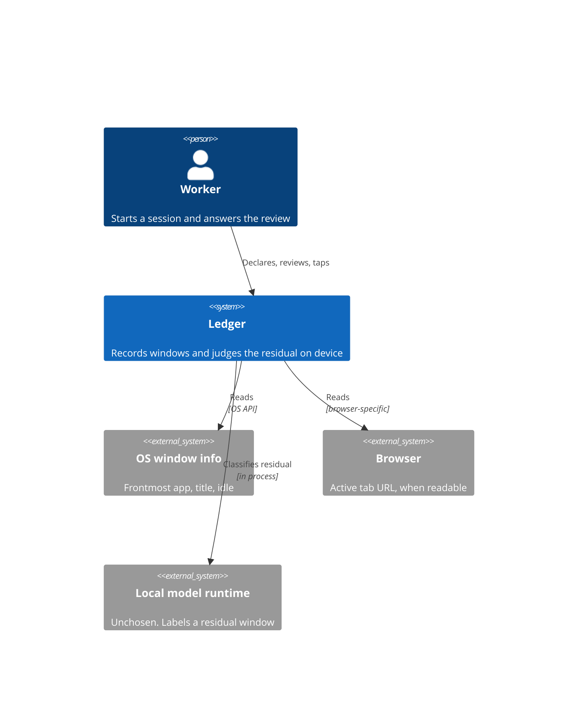
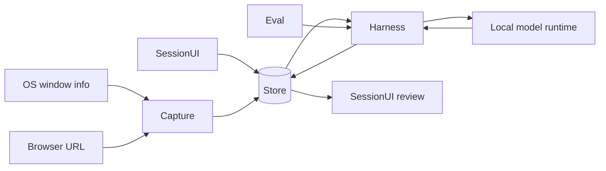

# System Design — Ledger

> **Purpose:** the HOW, at component level. Feature behavior stays in [`prd.md`](prd.md). Field types stay in [`data-model.md`](data-model.md).

## 1. System Context

The boundary is the machine. There is no account server and no model API on the network. A failure of `oswin`, `browser`, or `runtime` is ours to show. A failure of the public internet is not on the path of the review.

## 2. Components & Responsibilities

| Component | Responsibility | Owns | Depends on | Serves |
|-----------|----------------|------|------------|--------|
| SessionUI | Declare, running, review, ledger, privacy | The outcome answer, and nothing about how a visit is split | Store | F-001, F-004, F-006, F-007 |
| Capture | Open and close visits, mark away, record gaps | Visit boundaries | OS window info, browser URL | F-002 |
| Harness | Apply rules, then memory, then the model. Accept taps. | Verdicts and memory rows | Store, Capture, local model runtime | F-003, F-005 |
| Eval | Run labeled fixtures through Harness and count matches by source | Eval-case results | Harness | F-008 |
| Store | Read and write the local file | The file and its transactions, not the meaning of a row | The disk | F-001, F-002, F-003, F-004, F-005, F-006, F-007, F-008 |

SessionUI does not write verdicts. A tap goes to Harness. Eval does not write user visits. Fixtures stay in the eval set.

## 3. Data Flow

Titles and URLs cross from the OS into Store and stop. The model runtime is on the same machine. The diagram has no edge that leaves the device.

## 4. Technology Choices & Trade-offs

| Choice | Why | Trade-off accepted | Alternative rejected | Authority |
|--------|-----|--------------------|----------------------|-----------|
| Desktop process, not a browser extension | An extension cannot see the other apps ([`idea.md` §4](../idea.md)) | We take an OS permission the extension never needed | Extension plus a web app, which is what MEANT was | Our judgment, from the problem |
| No network client in the build | The review has to work with the network gone, and titles must not leave ([`prd.md` BR-005](prd.md)) | No sync, no hosted backup | The prior project's hosted database and cloud model gateway | Hackathon hard requirement, plus F-012 |
| Harness order in [ADR-002](adr/ADR-002-harness-order.md) | The probe showed the model is wrong on an obvious window | Three sources to keep visible in the review | A model call on every window | Our judgment |
| Single file on the machine | One user, one computer, delete means delete the file | No multi-user and no remote restore | Hosted Postgres | Our judgment |
| App shell and model runtime unchosen | The only runtime fact we have is a probe, not a product choice | The capture spike cannot start until Bennet picks | Treating the probe's Apple on-device model as the selected runtime. It was available. It was not chosen. | Bennet |

The probe, so it is not mistaken for a budget. On 2026-10-09, `SystemLanguageModel` on an M4, 16 GB, macOS 26.5, answered in 3.89 seconds cold and about 0.2 seconds warm, and was wrong on 2 of 4 windows. n=4. One machine. Not a latency target and not a precision result.

## 5. Integration Points

| Service | Protocol | Failure mode | Our behaviour on failure |
|---------|----------|--------------|--------------------------|
| OS window info | OS API | Permission denied or the API returns nothing | Capture writes no invented visit. The review states the gap (US-002). |
| Browser URL | Browser-specific, unchosen | URL not readable for that browser | The visit keeps app and title. URL stays empty. Harness may return unclear. |
| Local model runtime | In-process call, runtime unchosen | Not installed, timeout, or a string outside the three labels | Harness stores unclear and does not block Capture or End (US-003, BR-003). |
| Network | None | Not applicable. This build does not open one. | Nothing in the review waits on it. A dependency that phones home is outside what the privacy panel can see (US-008). |

## 6. Deployment Topology

- One process on the user's computer. No server, no staging environment, no shared database between teammates.
- The demo machine for the 2026-10-09 probe was an Apple M4, 16 GB, macOS 26.5. That is a fact about the probe, not the supported matrix. The supported matrix is unwritten until the shell is chosen.
- Judges reproduce from the repository instructions. Those instructions do not exist yet, because there is no build. They are owed before the 2026-10-10 10:00 Asia/Manila freeze.
- The factory in `fmd/` is not part of the product and is not in git.

## 7. Scaling Strategy & Non-Functional Risk

- **What scales, and how:** nothing across users. One file grows with visits. The harness skips the model when a rule or a memory row hits, which is the only volume control.
- **Which non-functional requirement is at risk under this design:** time from a window switch to a stored verdict, on a machine weaker than the probe machine. No `quality.md` exists, so there is no numeric budget to meet. The probe numbers in §4 are the only measurement, and they are not a target.

## 8. Doc Integrity Check

- [x] Each component names what it owns. SessionUI owns the outcome. Capture owns visit boundaries. Harness owns verdicts and memory. Eval owns eval results. Store owns the file.
- [x] Every Must and Should feature appears in §2. F-009 through F-013 are Won't and have no component.
- [x] Each technology row names a rejected alternative and an authority. The unchosen shell is a row, not a silent default.
- [x] Each integration names a failure mode and the behavior.
- [x] There is no network-exposed surface to hand to a security doc.
- [x] Field types and the 0.80 bar are not restated as targets here.
- [x] The inherited risk is model accuracy on the residual. It is named in §4 and is not treated as settled.

## References

- [`prd.md`](prd.md)
- [`data-model.md`](data-model.md)
- [`idea.md`](../idea.md)
- [ADR-001](adr/ADR-001-silent-review.md), [ADR-002](adr/ADR-002-harness-order.md)
- `quality.md`, `security.md`, and `api.md` are not in this doc set. See [`context.md`](../context.md).
